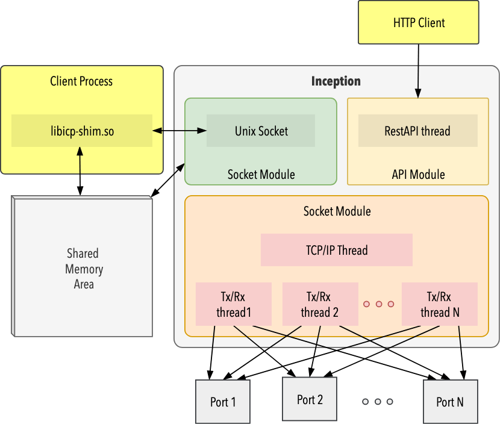

# Inception

This code base provides an infrastructure and application test and analysis
framework.  Discrete modules provide functionality with the assistance of a
common core.  Each module also defines a REST API via a [Swagger](https://swagger.io)
specification to allow users to access and control its functionality.

The first set of modules for Inception provides a user-mode stack.  This
stack is an amalgam of [lwip](https://savannah.nongnu.org/projects/lwip/) for
TCP/IP protocol support and [DPDK](https://www.dpdk.org) for network connectivity.
Configuration and management of network ports and interfaces is defined in this
[REST API](api/schema/v1/inception-core.yaml).

## Dependencies

Inception is written in modern C/C++, e.g. C11 and C++17. The build process is
handled via `make` and uses [clang](https://clang.llvm.org) by default.  Inception
also depends on some 3rd party components:

* [DPDK](https://www.dpdk.org) - used for network drivers and packet buffers
* [expected](https://github.com/TartanLlama/expected) - a std::expected implementation
* [json](https://github.com/nlohmann/json) - a modern JSON library for C++
* [ZeroMQ](http://zeromq.org) - a distributed messaging library
* [lwip](https://savannah.nongnu.org/projects/lwip/) - a lightweight IP stack
* [pistache](http://pistache.io) - a C++ REST framework with [Swagger](https://swagger.io)
  support

Unit tests are written with [catch2](https://github.com/catchorg/Catch2), a modern C++
unit testing framework.  Additionally, build acceptance tests are run with
[mamba](https://github.com/nestorsalceda/mamba), a Python based test runner.

## Design

Inception is inherently multi-threaded.  In order to maximize per thread
performance, Inception uses lockless and non-blocking techniques instead
of traditional thread synchronization methods.

One motivation for using ZeroMQ is to allow message passing between components.
For example, logging is handled internally by a thread whose sole job is to
listen for incoming logging messages on a ZeroMQ socket and write them to the
console. This design  ensures serialization of log messages while allowing
asynchronous logging from client threads.

In cases where message passing is not applicable, components use lockless
data structures to communicate between threads.  The framework contains
both a lockless list and hash-table implementation.

## Overview

Inception is composed of a core framework and three primary code modules:

* api: The API module runs a web service that provides access to Inception
  internals via a REST interface.
* packetio: The packetio module contains the stack and packet forwarding logic
  necessary to pass packets between the physical ports and the user created
  interfaces.
* socket: The socket module provides a BSD sockets compatible API to the
  stack in the packetio module.  It creates the shared memory and UNIX domain
  socket required by the libicp-shim.so library for access to stack functions.

The core framework provides support for common functionality across all
modules, such as logging, option handling, data structures, event loops, etc.

Client access to the stack is provided via a shim library, libicp-shim.so, that can be
used with any program via the LD_PRELOAD environment variable.

Additionally, users can create their own modules to link directly into the inception
binary to allow direct access to the packetio and socket module.
