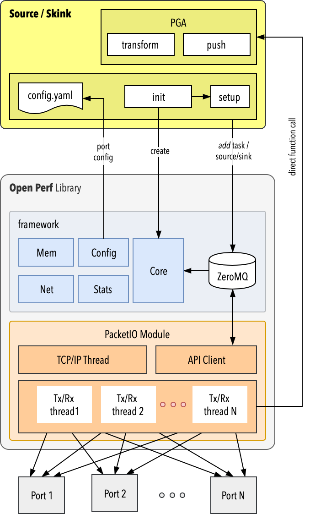

# Internal API 

This section gives some practical example for creating an using the OpenPerf stack usign the Internal APIS (i.e. without LD-Preload Shim)



## Creating the OpenPerf Stack

```C++	
void main(int argc, const char ** argv) {
	icp_thread_setname("icp_main");
	
	void *context = zmq_ctx_new();
	if (!context) {
	    icp_exit("Could not initialize ZeroMQ context!");
	}
	
	/* Do initialization... */
	icp_init(context, argc, argv);
}
```

The application should be started with the arguments `--config config.yaml` in order for `icp_init` to locate the configuration file. 

> The reason for passing the configuration as an arugment to the program is to be able to switch between configuration files when multiple NICs are available. For instance, one would run a test with program -c config_nic1.yaml then program -c config_nic2.yaml, etc.

The `context` is a ZeroMQ message queue used to communicate with the OpenPerf engine. The internal API client can be accessed using

```C++	
auto client = icp::packetio::internal::api::client(context);
```

Once the test is finished, cleanup the stack using:

```C++	
/* ... then clean up and exit. */
icp_halt(context);
```

Note that in the following examples, this configuration is uses (is exposes `port0` and it's associated _interface_).

```
modules:
  packetio:
    dpdk:
      port-ids:
        port0: port0

resources:
  /interfaces/interface0:
    port_id: port0
    config:
      protocols:
        - eth:
            mac_address: "00:10:94:ae:d6:ab"
        - ipv4:
            method: static
            static:
              address: "198.18.25.1"
              prefix_length: 15
              gateway: "198.18.0.1"
```

## Packet Generator

Generating packets is a easy as 

```C++	
client.add_source("port0", source0);
```
	
Where `port0` must be defined in the configuration file (`config.yaml`) and where `source0` is an OpenPerf source:

```C++	
auto source0 = 	icp::packetio::packets::generic_source(test_source());
```

The test source needs to implement the following methods:
	
```C++	
virtual std::string id() const = 0;
virtual bool active() const = 0;
virtual uint16_t burst_size() const = 0;
virtual uint16_t max_packet_length() const = 0;
virtual packets_per_hour packet_rate() const = 0;
virtual uint16_t transform(packet_buffer* input[], uint16_t input_length, packet_buffer* output[]) = 0;
```

As well as the move semantics for those two methods (which is defined as the default semantics since the test source only has copyable data members).

```C++
test_source(test_source&& other) = default;
test_source& operator=(test_source&& other) = default;
```

Method | return type | Comment 
----- | ---- | ---
`Id` | string | Worker ID ( or core ID?)
`Active` | boolean | true if generation is active 
`burst_size` | uint16 | Needed for prealloc
`max_packet_length` | uint16 | Needed for prealloc
`packet_rate` | icp::units::rate | Packet rate
`transform` | ... | Actual packet generator

The `transform` is the core of the generator. A UDP/IP/ETH generator would look like this:

```C++	
using namespace icp::packetio;
using namespace icp::packetio::packets;
	
uint16_t transform(packet_buffer* input[], uint16_t count, packet_buffer* output[])
{
    auto src_mac = mac_address{ 0x00, 0xff, 0xaa, 0xff, 0xaa, 0xff };
    auto dst_mac = mac_address{ 0x00, 0xaa, 0xff, 0xaa, 0xff, 0xaa };
    auto src_ip = ipv4_address("198.18.25.1");
    auto dst_ip = ipv4_address("198.19.25.1");

	std::for_each(input, input + count,[&](auto packet) {
      auto tmp = packets::to_data<test_packet>(packet);

      initialize_eth_header(tmp->ether, src_mac, dst_mac, RTE_ETHER_TYPE_IPV4);
      initialize_ipv4_header(tmp->ipv4, src_ip, dst_ip, 26);
      initialize_udp_header(tmp->udp, 3357, 3357, 18);

      packets::length(packet, 60);
      *output++ = packet;
    });
    return count;
}
```

The `auto tmp = packets::to_data<test_packet>(packet);` will map the input packet into DPDK layers:

```C++	
struct test_packet {
    struct rte_ether_hdr ether;
    struct rte_ipv4_hdr  ipv4;
    struct rte_udp_hdr   udp;
} __attribute__((packed));
```

The `__attribute__((packed))` is needed to ensure that member fields have the smallest possible alignment.

Note that the application is responsible to computing the checksums of each layer (if there is checksum). For example:

```C++	
static void initialize_ipv4_header(rte_ipv4_hdr& ip_hdr,
                                   ipv4_address& src_addr, ipv4_address& dst_addr,
                                   uint16_t pkt_data_len)
{
    auto pkt_len = pkt_data_len + sizeof(ip_hdr);
    /*
     * Initialize IP header.
     */
    ip_hdr.version_ihl     = 0x45;
    ip_hdr.type_of_service = 0;
    ip_hdr.fragment_offset = 0;
    ip_hdr.time_to_live    = 0x10;
    ip_hdr.next_proto_id   = IPPROTO_UDP;
    ip_hdr.hdr_checksum    = 0;
    ip_hdr.packet_id       = 0;
    ip_hdr.total_length    = htons(pkt_len);
    ip_hdr.src_addr        = htonl(src_addr.data());
    ip_hdr.dst_addr        = htonl(dst_addr.data());
	
    /*
     * Compute IP header checksum.
     */
    auto ptr16 = reinterpret_cast<uint16_t*>(std::addressof(ip_hdr));
    unsigned ip_cksum = std::accumulate(ptr16, ptr16 + 10, 0U,
                                        [](unsigned sum, auto chunk){ return (sum + chunk); });
	
    /*
     * Reduce 32 bit checksum to 16 bits and complement it.
     */
    ip_cksum = ((ip_cksum & 0xFFFF0000) >> 16) + (ip_cksum & 0x0000FFFF);
    ip_cksum = (~ip_cksum) & 0x0000FFFF;
    ip_hdr.hdr_checksum = static_cast<uint16_t>(ip_cksum == 0 ? 0xFFFF : ip_cksum);
}
```

Full generator source code available from [source-example/main.cpp](../../targets source sink-example/main.cpp)

## Sink

Creating sinks, aka analysers, is as easy as generators:

```C++	
auto sink0 = icp::packetio::packets::generic_sink(test_sink());
auto success = client.add_sink("port0", sink0);
```
    
The test_sink need to implement the following methods:

```C++	
virtual std::string id() const = 0;
virtual uint16_t push(packet_buffer* const packets[], uint16_t length) = 0;
```

As well as the move semantics for those two methods (which is more complex that the test_source, since the sink has to cope with non-copyable members, such as the pointer to the counter (`std::unique_ptr<packet_counter<uint64_t>> m_counter`)).


```C++
test_sink(test_sink&& other)
test_sink& operator=(test_sink&& other)
```


The `id` method is the same as for the generator, allowing to specify on which worker/core the sink is running. The `push` method is called for each received packet. For instance, this code will create statistics for received packet length.

```C++	
uint16_t push(icp::packetio::packets::packet_buffer* const packets[], uint16_t length) const
{
    for(uint16_t i = 0; i < length; i++) {
        m_counter->add(icp::packetio::packets::length(packets[i]));
    }
    return (length);
}
```

Full sink source code available from [sink-example/main.cpp](../../targets/sink-example/main.cpp)
