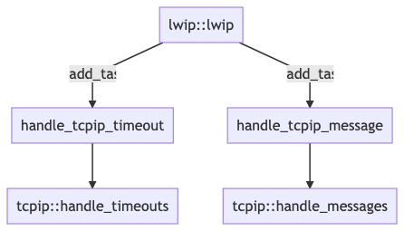

# LWIP Customization for OpenPerf

## Files

There are 6 files overwritten:

   * `packetio/stack/tcpip.cpp`
   * `packetio/stack/tcp_in.c`
   * `packetio/stack/tcp_out.c`  

   * `packetio/memory/dpdk/memp.c`
   * `packetio/memory/dpdk/pbuf.c`


The compilation overwrite is done by removing the file from `mk/lwip.mk`, eg:

```diff
LWIP_CORE_SOURCES := \
  core/init.c \
  core/def.c \
  core/dns.c \
-  core/tcpip.c \
```

And adding the new file in `src/modules/packetio/stack/directory.mk`, eg:

```diff
PIO_SOURCES += \
  stack/tcp_in.c \
  stack/tcp_out.c \
  stack/tcpip.cpp \
```

In `mk/lwip.mk`,  

### `stack/tcpip.c` 

One of the main change is to replace the global `tcpip_mbox` with a function call:

```diff
-static sys_mbox_t tcpip_mbox;
+auto tcpip_mbox = icp::packetio::tcpip::mbox();
```

The other change is to replace the previous _tcpip_thread_ with an OpenPerf compatible worker and callback implementation.

For this purpose, two new functions under the `icp::packetio::tcpip` namespace provide the core functionality of the lwip TCP/IP stack:  `handle_timeouts` and `handle_messages`.

```cpp
std::chrono::milliseconds handle_timeouts()
{
    std::chrono::milliseconds sleeptime;
    do {
        sys_check_timeouts();
        sleeptime = std::chrono::milliseconds(sys_timeouts_sleeptime());
    } while (sleeptime.count() == 0);

    return (sleeptime);
}

int handle_messages(sys_mbox_t mbox)
{
    struct tcpip_msg *msg = nullptr;

    LWIP_TCPIP_THREAD_ALIVE();

    /* acknowledge notifications */
    sys_mbox_clear_notifications(&mbox);

    while (sys_arch_mbox_tryfetch(&mbox, (void **)&msg) != SYS_MBOX_EMPTY) {

        switch (static_cast<int>(msg->type)) {
        case TCPIP_MSG_API:
            msg->msg.api_msg.function(msg->msg.api_msg.msg);
            break;

        case TCPIP_MSG_API_CALL:
            msg->msg.api_call.arg->err = msg->msg.api_call.function(msg->msg.api_call.arg);
            sys_sem_signal(msg->msg.api_call.sem);
            break;

        case TCPIP_MSG_INPKT:
      ...
        }
    }

    return (0);
}
```




The original implementation was like this:

```cpp
static void tcpip_thread(void *arg)
{
  struct tcpip_msg *msg;
  LWIP_MARK_TCPIP_THREAD();
  LOCK_TCPIP_CORE();
  if (tcpip_init_done != NULL) {
    tcpip_init_done(tcpip_init_done_arg);
  }
  while (1) {
    LWIP_TCPIP_THREAD_ALIVE();
    TCPIP_MBOX_FETCH(&tcpip_mbox, (void **)&msg);
    tcpip_thread_handle_msg(msg);
  }
}

static void tcpip_thread_handle_msg(struct tcpip_msg *msg)
{
  switch (msg->type) {
    case TCPIP_MSG_API:
      msg->msg.api_msg.function(msg->msg.api_msg.msg);
      break;
    case TCPIP_MSG_API_CALL:
      msg->msg.api_call.arg->err = msg->msg.api_call.function(msg->msg.api_call.arg);
      sys_sem_signal(msg->msg.api_call.sem);
      break;
  ...
}
```

### `stack/tcp_in.c` 

Support for Generic Segmentation Offload

```diff
+ #include "packetio/stack/gso_utils.h"
```

Support for partial segment acknowledgment:

```diff
static struct tcp_seg * tcp_free_acked_segments(struct tcp_pcb *pcb, struct tcp_seg *seg_list, const char *dbg_list_name, struct tcp_seg *dbg_other_seg_list)
{
   ... 

+  /* If we still have an unacknowledged segment, check to see if part of it
+   * has been acked.  If so, trim the segment so that only the un-acked
+   * portion remains. */
+  if (seg_list != NULL &&
+      TCP_SEQ_GT(ackno, lwip_ntohl(seg_list->tcphdr->seqno)) &&
+      TCP_SEQ_LT(ackno, lwip_ntohl(seg_list->tcphdr->seqno) + TCP_TCPLEN(seg_list))) {
+      u32_t acked_from_seg = ackno - lwip_ntohl(seg_list->tcphdr->seqno);
+      pcb->snd_queuelen -= packetio_stack_gso_segment_ack_partial(seg_list, acked_from_seg);
+      recv_acked += acked_from_seg;
+  }
```

Remove the dupack count reset:

```diff
-      /* If Clause (1) or more is true, but not a duplicate ack, reset
-       * count of consecutive duplicate acks */
-      if (!found_dupack) {
-        pcb->dupacks = 0;
-      }
```

### `stack/tcp_out.c` 


The main change is to add support for **Generic Segmentation Offload**.

```diff
+#include "packetio/stack/gso_utils.h"

+#if TCP_CHECKSUM_ON_COPY
+#error "TCP_CHECKSUM_ON_COPY is not supported"
+#endif
```

Add `TCP_COPY_TO_PBUF2` maco:

```diff
+#define TCP_COPY_TO_PBUF2(pbuf, offset, data, len, chksum, chksum_swapped) \
+    packetio_stack_gso_pbuf_copy(pbuf, offset, data, len)
```

Replace `TCP_OVERSIZE_CALC_LENGTH`:

```diff
-#define TCP_OVERSIZE_CALC_LENGTH(length) ((length) + TCP_OVERSIZE)
+ #define TCP_OVERSIZE_CALC_LENGTH(length) packetio_stack_gso_oversize_calc_length(length)
```

Change in function `tcp_pbuf_prealloc` the statement `*oversize = p->len - length;` with:

```diff
static struct pbuf *
tcp_pbuf_prealloc(pbuf_layer layer, u16_t length, u16_t max_length, u16_t *oversize, const struct tcp_pcb *pcb, u8_t apiflags, u8_t first_seg) {

+  /* We might have more than a MSS worth of oversize, however various stack
+   * assertions insist that we should not.  Hence, clamp our oversize value. */
+  *oversize = LWIP_MIN(alloc - length, TCP_MSS);
+  /* trim p->len to the currently used size */
+  if (*oversize) {
+      uint16_t length_left = length;
+      for (struct pbuf* q = p; q != NULL; q = q->next) {
+          q->tot_len = length_left;
+          if (q->len <= length_left) {
+              length_left -= q->len;
+          } else if (length_left) {
+              q->len = length_left;
+              length_left = 0;
+          } else {
+              LWIP_ASSERT("dangling pbuf", 0);
+          }
+      }
+  }

}
```

In function `tcp_write` change the _max_seglen_ computation: 

```diff
-mss_local = LWIP_MIN(pcb->mss, TCPWND_MIN16(pcb->snd_wnd_max / 2));
-mss_local = mss_local ? mss_local : pcb->mss;
+max_seglen = LWIP_MAX(
+ LWIP_MIN(
+   packetio_stack_gso_max_segment_length(pcb),
+   TCPWND_MIN16(pcb->snd_wnd_max) / 2),
+ tcp_mss(pcb)
+);
```

Add replace `TCP_DATA_COPY2` with `TCP_COPY_TO_PBUF2` (applies only if `TCP_WRITE_FLAG_COPY` flag is set).

```diff
- TCP_DATA_COPY2((char *)p->payload + optlen, (const u8_t *)arg + pos, seglen, &chksum, &chksum_swapped);
+ TCP_COPY_TO_PBUF2(p, optlen, (const u8_t *)arg + pos, seglen, &chksum, &chksum_swapped);
```

Add this piece of code to handle GSO:

```diff
+    /* We know our segment is at least as big as the MSS.  However, it could still be
+     * larger than the window.  Check the remaining window size and if our segment
+     * exceeds it, split the segment and send what the windows allows. */
+    tcpwnd_size_t snd_wnd_left = wnd + pcb->lastack - lwip_ntohl(seg->tcphdr->seqno);
+    if (snd_wnd_left < seg->len) {
+        /* Always split at a multiple of the MSS */
+        uint16_t split = (snd_wnd_left / tcp_mss(pcb)) * tcp_mss(pcb);
+        err = packetio_stack_gso_segment_split(pcb, seg, split);
+        if (err != ERR_OK) {
+            pcb->flags |= TF_NAGLEMEMERR;
+            return err;
+        }
+    }
```

In function `tcp_rexmit` , add the call to `tcp_ext_arg_set` :

```diff
err_t tcp_rexmit(struct tcp_pcb *pcb)
{
  struct tcp_seg * seg = pcb->unacked;
  /* Give up if the segment is still referenced by the netif driver due to deferred transmission. */
  if (tcp_output_segment_busy(seg)) {
    return ERR_VAL;
  }

  /* Move the first unacked segment to the unsent queue. Keep the unsent queue sorted. */
  pcb->unacked = seg->next;

  struct tcp_seg ** cur_seg = &(pcb->unsent);
  while (*cur_seg && TCP_SEQ_LT(lwip_ntohl((*cur_seg)->tcphdr->seqno), lwip_ntohl(seg->tcphdr->seqno))) {
    cur_seg = &((*cur_seg)->next );
  }
  seg->next = *cur_seg;
  *cur_seg = seg;

  if (pcb->nrtx < 0xFF) ++pcb->nrtx;

  /* Don't take any rtt measurements after retransmitting. */
  pcb->rttest = 0;

  /* Do the actual retransmission. */
+ tcp_ext_arg_set(pcb, 0, (void*)(((uintptr_t)(tcp_ext_arg_get(pcb, 0))) + (seg->len / TCP_MSS) + 1));

  /* No need to call tcp_output: we are always called from tcp_input() and thus tcp_output directly returns. */
  return ERR_OK;
}
```

The [tcp_ext_arg_xxx](https://www.nongnu.org/lwip/2_1_x/group__tcp__raw__extargs.html) is used as an additional data storage per TCP PCB. In this function, it is used to counter the number of retransmissions. It is used from 

```cpp
void get_tcp_info(const tcp_pcb* pcb, tcp_info& info)
{
  ...
  info.tcpi_total_retrans = static_cast<uint32_t>
    (reinterpret_cast<uintptr_t>(tcp_ext_arg_get(pcb, 0)));
  ...
}
```


### `packetio/memory/dpdk/memp.c`

Overwrites the LwIP _memp_ implementation with DPDK based allocation (this change is discussed in the (PacketIO design doc)[module-packetio.md]. 

Functions replaced are `memp_init`, `memp_malloc`, `memp_free`. For reference, this is how the mbuf and pbufs are working:


### `packetio/memory/dpdk/pbuf.c`

The two functions  `pbuf_alloc` and `pbuf_realloc` are patched to cope with the mp-buf allocation scheme. 

The `pbuf_alloc` is responsible for allocating a chain of mbufs that fit the _length_ and _layer_.  It's typically called this way:

```cpp
PBUF_TRANSPORT = PBUF_LINK_ENCAPSULATION_HLEN + PBUF_LINK_HLEN + PBUF_IP_HLEN + PBUF_TRANSPORT_HLEN
pbuf_alloc(PBUF_TRANSPORT, sizeof(struct netbios_resp), PBUF_RAM);
```

This previous call would return a mbuf with headroom for the TCP/IP/MAC and payload of _sizeof(struct netbios_resp)_.

```diff
struct pbuf * pbuf_alloc(pbuf_layer layer, u16_t length, pbuf_type type)
{
  struct pbuf *p;
-  u16_t offset = (u16_t)layer;
+  u16_t offset = LWIP_MAX(layer, RTE_PKTMBUF_HEADROOM);

  switch (type) {
    case PBUF_POOL: {
      u16_t rem_len = length;
    do {
          struct pbuf *pbuf = (struct pbuf *)memp_malloc(MEMP_PBUF_POOL);

-          pbuflen = LWIP_MIN(rem_len, (u16_t)(PBUF_POOL_BUFSIZE_ALIGNED - LWIP_MEM_ALIGN_SIZE(offset)));
-          payload = LWIP_MEM_ALIGN((void *)((u8_t *)pbuf + SIZEOF_STRUCT_PBUF + offset))

+          struct rte_mbuf *m = packetio_memory_pbuf_to_mbuf(q);
+          pbuflen = LWIP_MIN(rem_len, (u16_t)(m->buf_len - LWIP_MEM_ALIGN_SIZE(offset)));
+          payload = LWIP_MEM_ALIGN((void *)((u8_t *)pbuf + PBUF_PRIVATE_SIZE + offset));

           pbuf_init_alloced_pbuf(pbuf, payload, rem_len, pbuflen, type, 0);
           rem_len = (u16_t)(rem_len - qlen);
           last->next = pbuf;  last = pbuf;
       } while (rem_len > 0);
       break;
```


This function essentially changes the way the _pbuf_ length is calculated. The regular LwIP code uses the constant `PBUF_POOL_BUFSIZE_ALIGNED` defined as ` TCP_MSS+40+PBUF_LINK_ENCAPSULATION_HLEN+PBUF_LINK_HLEN` to know the total available length from the _pbuf_.  While, for OpenPerf, the implementation uses the _mbuf_ length information `packetio_memory_pbuf_to_mbuf(pbuf)->buf_len`.

The pbuf overhead size is also changed from `SIZEOF_STRUCT_PBUF` to `PBUF_PRIVATE_SIZE` - to match the DPDK allocation scheme:

```cpp
#define SIZEOF_STRUCT_PBUF        LWIP_MEM_ALIGN_SIZE(sizeof(struct pbuf))
#define PBUF_POOL_BUFSIZE       (2048 + 128)  /* DPDK default MBUF buffer size */
#define PBUF_PRIVATE_SIZE       64
static_assert(PBUF_PRIVATE_SIZE >= sizeof(struct pbuf));
```


The reason for defining the offset (aka headroom) as `LWIP_MAX(layer, RTE_PKTMBUF_HEADROOM)` is to ensure that there is always as much headroom as possible. This would allow, for instance, to easilly encapsulate the MAC packet into a  VxLAN tunnel.


```diff
void pbuf_realloc(struct pbuf *p, u16_t new_len)
{
  while (rem_len > q->len) {

-  /* shrink allocated memory for PBUF_RAM (other types merely adjust their length fields) */
-  if (pbuf_match_allocsrc(q, PBUF_TYPE_ALLOC_SRC_MASK_STD_HEAP) && (rem_len != q->len)) {
-    /* reallocate and adjust the length of the pbuf that will be split */
-    q = (struct pbuf *)mem_trim(q, (mem_size_t)(((u8_t *)q->payload - (u8_t *)q) + rem_len));
-    LWIP_ASSERT("mem_trim returned q == NULL", q != NULL);
-  }

```
In this second `pbuf_realloc` function,  the code shrinking the _pbuf_ payload is removed. That's because the encapsulating DPDK _mbuf_ copes with payload headroom and tailroom, so it does not make sense to shrink the payload. 