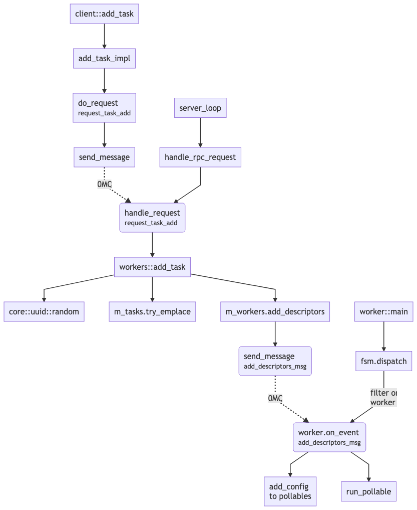

# Workers

## Client: Submitting tasks

Submitting task to the workers can be done via the internal server (operating on 0MQ). The `client::add_task` helper method facilates this operation:

```cpp
tl::expected<std::string, int> client::add_task(
        workers::context    ctx,
        std::string_view    name,
        event_notifier      notify,
        event_handler       on_event,
        std::any            arg)

using event_notifier = std::variant<void*, int>;
using event_handler  = std::function<int(generic_event_loop&, std::any)>;
```

The event notifier is either a _0MQ_ socket or an event file descriptor, which is used to signal that the event handler should be executed.

The _LWIP_ implementation, for instance, uses two tasks, one for the message processing, and the other for timeout handling:

```cpp
auto timeout_id = m_workers.add_task(
     workers::context::STACK,
      "stack timers",
      m_timerfd,
      handle_tcpip_timeout,
      m_timerfd);
```

It is also possible to submit tasks directly via the event loop, such as for the socket module, but that requires to have access to the `loop` object, which is only available from the loop handler callback.

```cpp
int server::handle_api_accept(event_loop& loop, std::any)
{
    for (;;) {
        sockaddr_un client;
        socklen_t len = sizeof(client);
        auto fd = accept(m_sock.get(),&client,&len);

        loop.add_callback("socket API for fd = " + std::to_string(fd),
            fd,
            std::bind(&server::handle_api_client, this, _1, _2),
            std::bind(&server::handle_api_error, this, _1),
            fd);
    }

    return (0);
}
```

> Note that the terms **callback** and **task** are equivalent in the context of workers. 


## Client: Handling tasks

The `on_event` LWIP timeout handler looks like:

```cpp
static int handle_tcpip_timeout(event_loop::generic_event_loop& loop, std::any arg)
{
    auto timer_fd = std::any_cast<int>(arg);

    uint64_t count;
    read(timer_fd, &count, sizeof(count));

    auto sleeptime = tcpip::handle_timeouts();
    auto wake_up = itimerspec {
        .it_interval = { 0, 0 },
        .it_value = duration_to_timespec(sleeptime)
    };

    return (timerfd_settime(timer_fd, 0, &wake_up, nullptr));
}
```

---

## Workers: Controller

The worker server is started with the packetIO module. 

```cpp
workers::make(context, *m_loop, *m_driver);
```

It returns an instance of `worker_controller` which is _abstracted_ as a `generic_workers` when handled from packetIO. 

The first step for the worker controller is to _launch_ the workers, via the `launch_workers` method. 

```cpp
static void launch_workers(void* context, worker::recycler* recycler, const worker::fib* fib)
{
    /* Launch work threads on all of our available worker cores */
    static std::string_view sync_endpoint = "inproc://dpdk_worker_sync";
    auto sync = icp_task_sync_socket(context, sync_endpoint.data());
    struct worker::main_args args = {
        .context = context,
        .endpoint = sync_endpoint.data(),
        .recycler = recycler,
        .fib = fib,
    };

    /* Launch a worker on every available core */
    rte_eal_mp_remote_launch(worker::main, &args, SKIP_MASTER)

    /*
     * Wait until all workers have pinged us back.  If we send out the configuration
     * before all of the workers are ready, they could miss it.
     */
    icp_task_sync_block(&sync, rte_lcore_count() - 1);
}
```

The [rte_eal_mp_remote_launch](http://doc.dpdk.org/api/rte__launch_8h.html#a2f78fc845135fe22c1ba1c870954b60a) function launches the `worker::main` callback on all lcores. 

The `icp_task_sync_block` is implemented as part of the core ICP framework. It waits for _n_ messages (`rte_lcore_count`) to be received on the `sync` _0MQ_ channel, and then clean the channel.

The _worker controller_ then initialize each worker context, for both _QSBR_ and _transmit load map_:

> QSBR = Quiescent State Based Reclamation. It's the type of RCU mechanism we use to reclaim unused memory from the data shared by the workers.

> "load map" is a member of the worker controller, named m_tx_loads, that maps worker id --> load. It's part of a constellation of members required to manage the tx workers. That comment might need an update.

Finally,  the _worker controller_ _starts_ `num_workers()` workers via the _worker command client_:

```cpp
void client::start(void* context, unsigned nb_workers)
{
    auto syncpoint = random_endpoint();
    auto sync = icp_task_sync_socket(context, syncpoint.c_str());
    send_message(m_socket.get(), start_msg{ syncpoint });
    icp_task_sync_block_and_warn(&sync, nb_workers, 1000,
         "Still waiting on start acknowledgment from queue workers ");
}
```

The above code works since `num_workers()` is equivalent to `rte_lcore_count()-1`. 


## Workers: Adding Tasks


After the client has sent a request for adding _tasks_,  the _workers controller_ receives the _add task_ event as an `request_task_add`, and processes it using the `add_task` method:

```cpp
worker_controller::add_task(workers::context ctx,
           std::string_view name,
           event_loop::event_notifier notify,
           event_loop::event_handler on_event,
           std::optional<event_loop::delete_handler> on_delete,
           std::any arg)
{
    /* XXX: We only know about stack tasks right now */
    if (ctx != workers::context::STACK) {
        return (tl::make_unexpected(EINVAL));
    }

    auto id = core::uuid::random();
    auto [it, success] = m_tasks.try_emplace(id, name, notify, on_event, on_delete, arg);
    if (!success) {
        return (tl::make_unexpected(EALREADY));
    }

    worker::descriptor descriptor(
        topology::get_stack_lcore_id(),
        std::addressof(it->second)
    )
    
    std::vector<worker::descriptor> tasks { descriptor }
    m_workers->add_descriptors(tasks);
    
    return (core::to_string(id));
}
```

> Note that the  `add_task()`  only works for `workers::context::STACK`.  The intent for external clients to use the sink/source related functions for adding things to the workers. The task stuff is really just to allow the stack module to insert the stack functions into the workers. This is all because of the requirement to run  _inception_  on as few as 2 cores (and hence the stack and the port I/O functions have to run in one worker).

Each task is assigned a random UUID first, using  `core::uuid::random`. The `m_tasks` is an `std::unordered_map` mapping UUID to the task. 

The task is then assigned to a worker using the method `topology::get_stack_lcore_id`, and then sent to the actually worker using `m_workers->add_descriptors`.

The [`topology::get_stack_lcore_id`](https://github.com/SpirentOrion/inception-core/blob/141d26f6ae6c02407603ead75b6675aed91a2868/src/modules/packetio/drivers/dpdk/topology_utils.cpp#L135) is straightforward - checks the NUMA with the most cores, and return the _first_ core. This function always returns the same core, since LWIP is single threaded.

> Note that port queues _are_ distributed amongst all available workers. This is done by [`topology::queue_distribute`](https://github.com/SpirentOrion/inception-core/blob/141d26f6ae6c02407603ead75b6675aed91a2868/src/modules/packetio/drivers/dpdk/topology_utils.cpp#L26)

Once the worker has received a task, it adds it to an internal structure called _pollable_, which is then processed using epoll (The next section explains it in details).The following flow-chart shows the complete sequence for adding tasks.


## Workers: Processing events

Workers deal with several different event sources.  All of those sources are interrupt-driven with the possible exception of RX queues. Hence, RX queues need to be separated from our other event types to handle them properly.

When running, the worker can decide to use polling or spinning mode based on the RX queue (file worker.cpp):

```cpp
static void run(run_args&& args)
{
    if (args.rx_queues.empty() || all_pollable(args.rx_queues)) {
        run_pollable(std::move(args));
    } else {
        run_spinning(std::move(args));
    }
}
```

The `all_pollable` checks for each task if adding them to an `epoll_poller` would return false.

```cpp
static bool all_pollable(const std::vector<task_ptr>& tasks)
{
    epoll_poller poller;

    auto add_visitor = [&](auto task) -> bool { return (poller.add(task)); };
    auto del_visitor = [&](auto task) { poller.del(task); };

    for (auto& task : tasks) {
        if (!std::visit(add_visitor, task)) {
            return (false);
        }
        std::visit(del_visitor, task);
    }
    return (true);
}
```

Why would the `add`  method return false? Because either of the `tasks` defined as (`using task_ptr = std::variant<callback*, rx_queue*, tx_queue*, tx_scheduler*, zmq_socket*>`) would return false:

```cpp
bool epoll_poller::add(task_ptr var)
{
    auto add_visitor = [&](auto task) -> bool { return (task->add(RTE_EPOLL_PER_THREAD, to_epoll_ptr(var))); };

    return (std::visit(add_visitor, var));
}
```

The `to_epoll_ptr` is based on _some_ pointer hacking, explained as:

> We can stuff at most 64 bits of data into an epoll event, so we tag the
> unused upper bits of our pointer with the variant index.  This allows
> us to return the proper variant object when we are polled without having
> to do any lookups.

In the case of the `callback` task, the implementation of `add` is based on the generic `pollable_event` class:

```cpp
class callback : public pollable_event<callback>;

template <typename Derived>
class pollable_event
{
public:
    bool add(int poll_fd, void* data)
    {
        m_event = rte_epoll_event{
            .epdata = {
                .event = EPOLLIN | EPOLLET,
                .data = data,
                .cb_fun = get_callback_fun(),
                .cb_arg = get_callback_arg()
            }
        };

        auto error = rte_epoll_ctl(poll_fd, EPOLL_CTL_ADD, static_cast<Derived&>(*this).event_fd(), &m_event);
       return (!error);
    }
```

Why would `rte_epoll_ctl` fail, thus making spinning the only polling method?  

> The  `add()`  function goes through the concrete pollable object, e.g.  `rx_queue`  or  `tx_queue`, etc. The  `rx_queue`'s  `add()`  method can fail if the queue (and hence the port) doesn't support rx interrupts (or have them enabled). This happens before  `rte_epoll_ctrl()`  is called.

> Note: you can disable rx interrupts from the command line via a configuration option.


The following graph shows the callgraph summary for pollable worker execution. 




