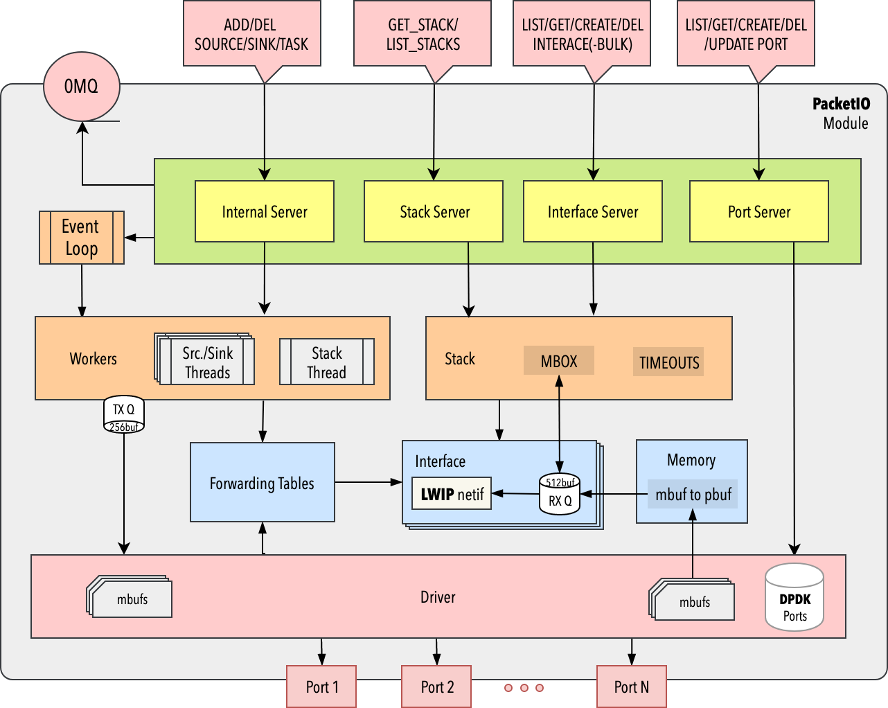
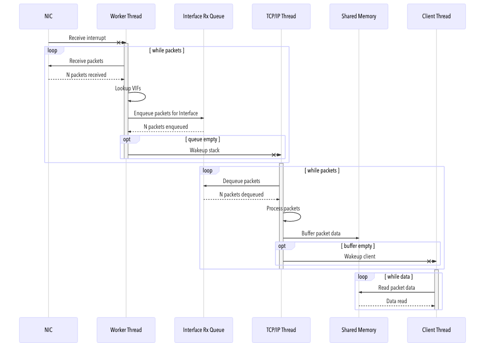
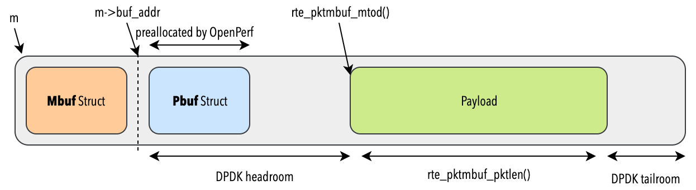
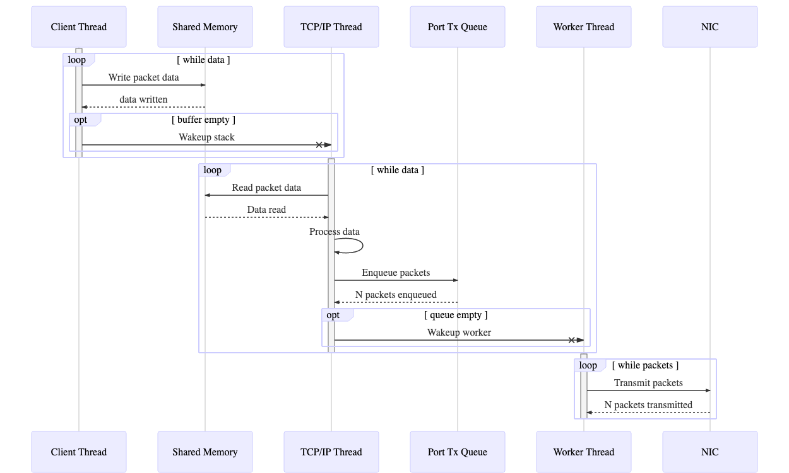

# PacketIO Module

The _packet IO_ module is the core of OpenPerf, handling both DPDK, LWIP and the workers. It is defined as a `service` which runs multiple servers/stack and components, as shown on the diagram below:



# PacketIO Module - Interfaces

One of those servers is the `interface server` component which handles the interface related 0MQ RPC requests.

In this section, the `BULK_CREATE_INTERFACES`  RPC request, reponsible to create a large number of interfaces in one single call, in being studied.

```C++
static void _handle_bulk_create_interface_request(generic_stack& stack, json& request, json& reply)
{
    for (auto& item : request["items"]) {
        auto interface_model = item.get<Interface>();

        // If user did not specify an id create one for them.
        if (interface_model.getId() == empty_id_string) {
            interface_model.setId(core::to_string(core::uuid::random()));
        }
        auto result = stack.create_interface(make_config_data(interface_model));
        response["items"].emplace_back(result.value());
    }
    reply["code"] = reply_code::OK;
    reply["data"] = response.dump();
    ...
}
```

The `stack` is created by the packet IO module, and is implemented as a `openperf::packetio::dpdk::lwip` with driver defined as `openperf::packetio::dpdk::eal::real_environment`.

> Note: the actual object is openperf::packet::dpdk::eal. The real_environment is just a named constructor function. There is also a test_envionrment constructor which is used to run the AAT's and sets up virtual NICs for testing.

```C++
std::unique_ptr<generic_stack> make(driver::generic_driver& driver,
                                    workers::generic_workers& workers)
{
    return std::make_unique<generic_stack>(openperf::packetio::dpdk::lwip(driver, workers));
}
```


When calling the `create_interface` on the stack, it is therefore the `lwip` stack implementation which is used

```C++
tl::expected<std::string, std::string> lwip::create_interface(const interface::config_data& config)
{
    auto port_index = m_driver.port_index(config.port_id);
    int port_idx = port_index.value();

    auto ifp = std::make_unique<net_interface>(config.id, config,
       m_workers.get_transmit_function(config.port_id), port_idx);

    m_workers.add_interface(ifp->port_id(), ifp->data());
    auto item = m_interfaces.emplace(std::make_pair(config.id, std::move(ifp)));
    return (item.first->first);

}
```

The `net_interface` is dealing the IP address allocation. The function `setup_ipv4_interface` handles _static_, _dhcp_ or _local_ IP addresses.

```C++
net_interface::net_interface(std::string_view id, const interface::config_data& config, driver::tx_burst tx, int port_index)
    : m_id(id)
    , m_port_index(port_index)
    , m_max_gso_length(net_interface_max_gso_length(port_index))
    , m_config(config)
    , m_transmit(tx)
{
    m_netif.state = this;

    /* Setup the stack interface */
    auto protocol_config = get_protocol_config<interface::ipv4_protocol_config>(m_config)
    setup_ipv4_interface(protocol_config,  m_netif);

    /**
     * Update queuing strategy if necessary; direct is the default.
     * XXX: this decision needs to come from a constructor parameter.
     */
    if (rte_lcore_count() > 2) {
        m_receive.emplace<netif_rx_strategy::queueing>(
            std::string_view(m_netif.name, 2),
            m_netif.num, port_index
        );
    }
    ...
}
```

The _Update queuing strategy if necessary; direct is the default._ is slightly more complex to analyse.

The `m_receive` (of type `rx_strategy`) is used when handling RX packets, such as `(std::visit(handle_rx_visitor, m_receive))`. The `rx_strategy` can be either `direct` (no queing) or `queueing` (with a 512 element queue size). The `emplace` method is used because `m_receive` is a variant.

> Question: What is the reason for `2` in `std::string_view(m_netif.name, 2)`?

> What happens is there is only 2 or less cores? The `m_receive` would not be updated, so packets could not be received?

>> So, this is a combination of a DPDKism and the desire to have OpenPerf work on the smallest system possible.

>> The `rte_lcore_count()` returns the total number of cores that DPDK is aware of. This includes the master core, which isn't allowed to run any data plane traffic and and worker cores which can run data plane traffic. The minimal system OpenPerf can run on is a 2 core box, where one core is the master and one core is the worker. In that case, the stack and the tx and rx worker callbacks are all run in the same thread, so it doesn't make sense to use a queue to pass the the packets around. The rx_strategy_direct structure allows the receive worker to call directly into the stack when a packet is received. Obviously, the rx_strategy_queueing just sticks the packet in a queue and (maybe) wakes up the stack. There is a similar process on the transmit side, which is why the net_interface object has driver::tx_burst, which is a transmit function, as a contstructer parameter.

>> A std::variant always contains an object. If you don't explicitly name a type, then the default constructor will instantiate the first type in the variant definition. So, when the net_interface object is created, m_receive contains a `rx_strategy_direct` object.


While the _worker_ `add_interface` copes with adding the Ethernet MAC address to the port.

```C++
void worker_controller::add_interface(std::string_view port_id, std::any interface)
{
    auto port_idx = m_driver.port_index(port_id);

    /* We really only expect one type here */
    auto ifp = std::any_cast<netif*>(interface);
    auto mac = net::mac_address(ifp->hwaddr);

    if (m_fib->find_interface(*port_idx, mac)) {
        throw std::runtime_error("Interface already exists in FIB");
    }

    auto port = model::physical_port(*port_idx, port_id);
    port.add_mac_address(mac);

    auto to_delete = m_fib->insert_interface(*port_idx, mac, ifp);
    m_recycler->writer_add_gc_callback([to_delete](){ delete to_delete; });

}
```

The `m_recycler` (of type `packetio::recycle::depot<RTE_MAX_LCORE>`) is used to safely deleting data shared with a bunch of reader threads. For instance, when the port is shutdown, it can ensure that all interfaces are cleaned-up, unless referenced by their another thread. `m_recycler` is an [RCU](https://math.mit.edu/research/highschool/primes/materials/2016/conf/10-1%20Sheth-Welling-Sheth.pdf) implementation. The worker threads will periodically update their checkpoints to let the main thread know when it is safe to run the callbacks to delete objects.

The `port.add_mac_address` is using DPDK `rte_eth_dev_mac_addr_add` to add the MAC as a valid RX address. If this DPDK fails, the interface is turned into promiscuous mode.

The `m_fib` (of type `packetio::forwarding_table<netif, packets::generic_sink, RTE_MAX_ETHPORTS>`) is used as the _rx distpatch table_, to know how to associate MACs to interfaces.  It is very nicely implemented as templated code. The `insert_interface` code is defined as:

```C++
interface_map* forwarding_table::insert_interface( uint16_t port_idx, const net::mac_address& mac, Interface* ifp)
{
    assert(port_idx < MaxPorts);

    auto original = m_interfaces[port_idx].load(std::memory_order_relaxed);
    auto updated = new interface_map(std::move(original->set(mac, ifp)));
    return (m_interfaces[port_idx].exchange(updated, std::memory_order_release));
}
```

The `interface_map` is defined as `immer::map<net::mac_address, Interface*>`.
[Immer](https://sinusoid.es/immer/) is a library of persistent and immutable data structures written in C++. These enable whole new kinds of architectures for interactive and concurrent programs of striking simplicity, correctness, and performance.

> The immer `map` provides a good trade-off between cache locality, search, update performance and structural sharing. It does so by storing the data in contiguous chunks of 2^B elements. When storing big objects, the size of these contiguous chunks can become too big, damaging performance. If this is measured to be problematic for a specific use-case, it can be solved by using a immer::box to wrap the type T.

> B default value is 5, therefore chunks can handle 32 elements. Storting 1M interfaces would require 31K chunks.

# Packet IO - Receving Packets (at interface level)


Once a packet is received by DPDK, it goes through the `rx_interace_dispach`, which associates the right interface from the packet mac address. If there is a matching interface, it eventually runs the `net_interface_rx`, which calls one either the `queueing` or `direct` buffering implementation:

```C++
err_t direct::handle_rx(pbuf* p, netif* netintf)
{
    return (ethernet_input(p, netintf));
}
```

The `direct` implementation justs calls `ethernet_input`, which is a _LWIP_ method. The `queueing` is slightly more complex, but in short, uses a _DPDK_ ring to keep track of the buffers, and eventually calls the `ethernet_input` _LWIP_ method.


```C++
err_t queueing::handle_rx(pbuf* p, netif* netintf)
{
    if (rte_ring_enqueue(m_queue.get(), p) != 0) {
        /* Queue is full ... */
        return (ERR_BUF);
    }
    if (!m_notify.test_and_set(std::memory_order_acquire)) {
        tcpip_inpkt(p, netintf, net_interface_rx_notify);
    }
    return (ERR_OK);
}

err_t queueing::handle_rx_notify(netif* netintf)
{
    static constexpr size_t rx_burst_size = 32;
    std::array<pbuf*, rx_burst_size> pbufs;

    do {
        auto nb_pbufs = rte_ring_dequeue_burst(m_queue.get(),(pbufs.data(), rx_burst_size, nullptr);

        for (size_t i = 0; i < nb_pbufs; i++) ethernet_input(pbufs[i], netintf);

    } while (!rte_ring_empty(m_queue.get()));

    m_notify.clear(std::memory_order_release);
    return (ERR_OK);
}
```

What is interresting to note is that the `tcpip_inpkt` implementation is overriden. In the original implementation, `tcpip_inpkt` accesses the TCPIP _mbox_ as a global variable `static sys_mbox_t tcpip_mbox;`. For OpenPerf, it uses the in-function declaration `auto tcpip_mbox = openperf::packetio::tcpip::mbox();`


```C++
sys_mbox_t openperf::packetio::tcpip::mbox()
{
    return (openperf::packetio::dpdk::tcpip_mbox::instance().get());
}
```

The explanation can be found in the `lwip.cpp` file:

> lwIP uses a global sys_mbox_t to allow communication between
> clients and the stack thread.  We initialize this object here and
> de-initialize it in our destructor.  This coupling is necessary to
> allow the process to cleanly shut down.  Luckily, client functions
> check for a valid mbox object before using it.  But if we don't
> invalidate it, they can block on a callback waiting for a response
< from our non-existent stack tasks.

Here is the receive sequency diagram summary:



# Packet IO - Sending Packets (at interface level)

The `net_interface_dpdk_init` is reponsible for setting the LWIP stack output and linking it to the DPDK driver.

```C++
static err_t net_interface_dpdk_init(netif* netif)
{
    net_interface *ifp = reinterpret_cast<net_interface*>(netif->state);

    rte_eth_dev_get_mtu(ifp->port_index(), &netif->mtu);

    auto info = model::port_info(ifp->port_index());
    netif->chksum_flags = (to_checksum_check_flags(info.rx_offloads()) | to_checksum_gen_flags(info.tx_offloads()));

    ...
    netif->linkoutput = net_interface_tx;
    netif->output = etharp_output;
    ...
}
```

The `linkoutput` function is called by ethernet_output() when it wants to send a packet on the interface. This function outputs the pbuf as-is on the link medium. While the `output` function is called by the IP module when it wants to send a packet on the interface. This function typically first resolves the hardware address, then sends the packet. For ethernet physical layer, this is usually etharp_output()


The `net_interface_tx` (_link output_) is (_code simplified below_)  passing the incoming packet to the `net_interface` implementation.

```C++
static err_t net_interface_tx(netif* netif, pbuf *p)
{
    net_interface *ifp = reinterpret_cast<net_interface*>(netif->state);
    return ifp->handle_tx(p);
}
```

The `handle_tx` handles the convertion from pbuf (from LWIP) to mbuf (DPDK) using the method `packetio_memory_mbuf_synchronize`. The `rte_mbuf_refcnt_update` is needed for bumping the reference count on the mbuf chain before transmitting, since, when the `handle_tx` function returns, the stack will free the pbuf chain.

```C++
err_t net_interface::handle_tx(struct pbuf* p)
{
    /*
     *      */
    auto m_head = packetio_memory_mbuf_synchronize(p);
    for (auto m = m_head; m != nullptr; m = m->next) rte_mbuf_refcnt_update(m, 1);

    /* Setup tx offload metadata if offloads are enabled. */
    if (~m_netif.chksum_flags & netif_tx_chksum_mask) {
        set_tx_offload_metadata(m_head, m_netif.mtu);
    }

    return (m_transmit(port_index(), 0, reinterpret_cast<void**>(m_head), 1) == 1 ? ERR_OK : ERR_BUF);
}
```

The mbuf/pbuf allocation scheme is very smart, and relying on the _headroom_ capability from the DPDK mbuf, as shown below. The `pbuf_alloc` method is overriden by OpenPerf to allocate and _mbuf_ instead with the headroom correctly setup with a puf.




The `m_transmit` corresponds to the worker `get_transmit_function`, which comes with two implementation: `direct` and `queued`. The _direct_ implementation eventually calls the `rte_eth_tx_burst` DPDK function.  The _queued_ implementation uses a DPDK ring of 256 elements.

In the case the driver is based on `net_ring` (used for _AAT_ only), the buffer needs to be copied... That's because of the portion of the mbuf private area to used store the lwip pbuf: The net_ring driver hands transmitted packets directly to another port, which could cause after-free bugs. If still not clear, the full explanation is:

>Sure. The net_ring driver is really only used for the AAT tests. It sets up a fake Ethernet driver that just queues/dequeues packets into a ring. Now, our mbuf's contain their pbuf data in a private area inside the mbuf.

>So, assume we are using net_ring without the copy. When the stack transmits a packet into the net_ring, it will enqueue the packet into the ring. At this point, the receive thread (using the DPDK port attached to the other side of the ring) can pick up the packet and hand it back to the stack before the transmit thread can free the pbuf. At this point, there is now a data race on the pbuf data inside the mbuf for the transmit and receive functions in the stack. This condition is especially troublesome for TCP since the stack has to hold on to the data in the pbuf until the other side can acknowledge it.

>Stuffing the pbuf data inside the mbuf is a huge efficiency win using real drivers/NICs, so this copy non-sense seems like a reasonable tradeoff when using the net_ring driver for testing.


When the application sends a packet (for instance UDP), how does LWIP knows which _net interface_ should be used? That's because, in the socket module, when a new socket is created, it will bind the socket to a location address and port (function `udp_bind`). If the socket is not bound, it will fail as decribed in this [bug report](http://savannah.nongnu.org/bugs/?3168):

> We can get that by including a check in udp_send() that checks if the local_ip of the udp pcb (if not is_any) is the same as the ip_addr of the netif used to send the packet (if not, we return ERR_VAL).
> If we then send to the socket/netconn, we get an error ERR_VAL into conn->err (do_send() has to be modified to catch more errors, see task #6880) that is translated to EINVAL.

Note that every c++ socket object in OpenPerf _socket module_ is a finite state machine that prevents clients from being able to use LwIP code in an unintended manner. Hence, it should not be possible to hit this LwIP bug at all using OpenPerf socket module.

Here is the transmit sequency diagram summary:




# Packet IO - LWIP Memory Managment

The LWIP _memp_ is [customized](https://github.com/SpirentOrion/inception-core/blob/master/src/modules/packetio/stack/include/lwipopts.h) to use specialized mem_malloc/mem_free instead of the lwip pool allocator.

```C++
#define MEMP_MEM_MALLOC 1
#define MEMP_USE_CUSTOM_POOLS 0
```

The `memp_malloc` function is overriden in [memory/dpkpk/memp.c](https://github.com/SpirentOrion/inception-core/blob/master/src/modules/packetio/memory/dpdk/memp.c) and using DPDK huge-page allocator (`rte_malloc`) for everything but the pbufs:

```C++
void * memp_malloc(memp_t type)
{
    switch (type) {
    case MEMP_PBUF:
    case MEMP_PBUF_POOL:
        auto pool = type==MEMP_PBUF?memp_ref_rom_mempools:memp_default_mempools;
        auto mbuf = rte_pktmbuf_alloc( load_mempool(pool,rte_socket_id())) )
        return packetio_memory_mbuf_to_pbuf(mbuf);
        break;

    default:
        return rte_malloc(memp_pools[type]->desc, memp_pools[type]->size, 0);
    }
}
```

The `memp_pools` is actually not a memory pool (i.e. a pre-allocated pool of buffers). Instead, all allocations are done directly in the rte_malloc hugepage. (Note: Creating actual pools for various stack objects has been tried, but it didn't make any measurable performance difference)

For `MEMP_PBUF` / `MEMP_PBUF_POLL`, it uses the DPDK poll based allocation `rte_pktmbuf_alloc`. The pool instanciated for each NUMA core (`rte_socket_id`).

```C++
static atomic_mempool_ptr memp_default_mempools[RTE_MAX_NUMA_NODES] = {};
static atomic_mempool_ptr memp_ref_rom_mempools[RTE_MAX_NUMA_NODES] = {};
```

Those pools are initialized by [`pool_allocator`](https://github.com/SpirentOrion/inception-core/blob/master/src/modules/packetio/memory/dpdk/pool_allocator.cpp).

```C++
pool_allocator::pool_allocator(const std::vector<model::port_info> &info,
                               const std::map<int, queue::count>& q_counts)
{
    for (auto i = 0U; i < RTE_MAX_NUMA_NODES; i++) {

        auto sum = std::accumulate(begin(info), end(info), 0, [&](unsigned lhs, const model::port_info& rhs) {
            if (rhs.socket_id() != i) return lhs
            return lhs + q_counts.at(rhs.id()).rx * rhs.rx_desc_count() + q_counts.at(rhs.id()).tx * rhs.tx_desc_count();
        });
        if (!sum) continue

        std::array<char, RTE_MEMPOOL_NAMESIZE> name_buf;
        snprintf(name_buf.data(), RTE_MEMPOOL_NAMESIZE, memp_ref_rom_mempool_fmt, i);
        m_ref_rom_mpools.emplace( i, create_pbuf_mempool(name_buf.data(), MEMP_NUM_PBUF, false, false, i));

        snprintf(name_buf.data(), RTE_MEMPOOL_NAMESIZE, memp_default_mempool_fmt, i);
        m_default_mpools.emplace( i, create_pbuf_mempool(name_buf.data(), sum, true, true, i));

    }
};
```

The `sum` takes into account the number of buffers, including those needed by the driver port implementation (see the PR for [fix DPDK default pool allocation](https://github.com/SpirentOrion/inception-core/commit/5a011f06ec8779efd779c1b7323b9bcfa823e940)).

Two pools are created - one for ROM/REF (most likely not used) - and the other for RAM based buffers.  The `create_pbuf_mempool` is using DPDK pools.


```C++
static rte_mempool* create_pbuf_mempool(const char* name, size_t size,
                                        bool cached, bool direct, int socket_id)
{
    size_t nb_mbufs = op_min(131072, pool_size_adjust(op_max(1024U, size)));

    rte_mempool* mp = rte_pktmbuf_pool_create_by_ops(
        name,
        nb_mbufs, /*The number of elements in the mbuf pool*/
        cached ? get_cache_size(nb_mbufs) : 0, /*Size of the per-core object cache*/
        PBUF_PRIVATE_SIZE, /*Size of application private are between the rte_mbuf structure and the data buffer*/
        direct ? PBUF_POOL_BUFSIZE : 0, /*Size of data buffer in each mbu*/
        socket_id,
        "stack");

    return (mp);
}
```

Note that the maximum number of buffers per NUMA is `128K`. Explanation below:

> The number of mbufs has to be a power of 2 and 128k seemed like a reasonable limit.  We can increase it if necessary.
> Additionally, the minimum number of mbufs is determined by the total number of ports/queues.  Each receive queue needs to be fully populated with mbufs in order to work plus you need extras for in-flight data.  Additionally, the number of interfaces isn't known when the pool is created, so there is no way to have the number of buffers proportional to them.
> It's certainly possible to run out of mbufs, though.  There are various memory allocation error counters in the stack that can tell you if you hit that condition. The number of mbufs comes from a fixed size pool and it's not possible to dynamically size them, so I don't have any good ideas for how to handle creating enough mbufs for any scenario without wasting memory resources for the common case.


 ## Memory Statistics

 The swagger API exposes a `StackMemoryStats` object. It is implemeted as a Packet IO `stack::memory_stats_data`, based on the _memp_ statistics (provided flag `MEMP_STATS` is enabled).

```C++
struct memory_stats_data {
    const char *name;
    int64_t available;
    int64_t used;
    int64_t max;
    int64_t errors;
    int64_t illegal;
};
```

This information is defined for each LWIP memory type (defined in `memp_std.h`), eg `RAW_PCB`, `UDP_PCB`, `TCP_PCB`, `TCP_PCB_LISTEN`.... `PBUF_POOL`.

The `errors` member is incremented each time memp fails to allocate (either mpbuf or eg PCB).

The `available`, `used` and `max` only report allocation for the m/pbufs pool - using the `rte_mempool_in_xxx_count` method for each NUMA pool. For the other types (`RAW_PCB`, `UDP_PCB`), it uses the LWIP stats. Since LWIP allocator is bypassed, this value should always be zero. The `illegal` does not seems to be used from OpenPerf, but only LWIP, so the value should also always be zero..

```C++
int64_t packetio_memory_memp_pool_avail(const struct memp_desc* mem)
{
    int64_t total_avail = 0;
    if (strncmp(mem->desc, "PBUF_POOL", 9) == 0) {
        for (int i = 0; i < RTE_MAX_NUMA_NODES; i++) {
            struct rte_mempool* node_mpool = get_mempool_by_id(memp_default_mempool_fmt, i);
            if (node_mpool) {
                total_avail += rte_mempool_avail_count(node_mpool);
            }
        }
    } else if (strncmp(mem->desc, "PBUF_REF/ROM", 12) == 0) {
        for (int i = 0; i < RTE_MAX_NUMA_NODES; i++) {
            struct rte_mempool* node_mpool = get_mempool_by_id(memp_ref_rom_mempool_fmt, i);
            if (node_mpool) {
                total_avail += rte_mempool_avail_count(node_mpool);
            }
        }
    } else {
        total_avail = mem->stats->avail;
    }

    return (total_avail);
}
```
