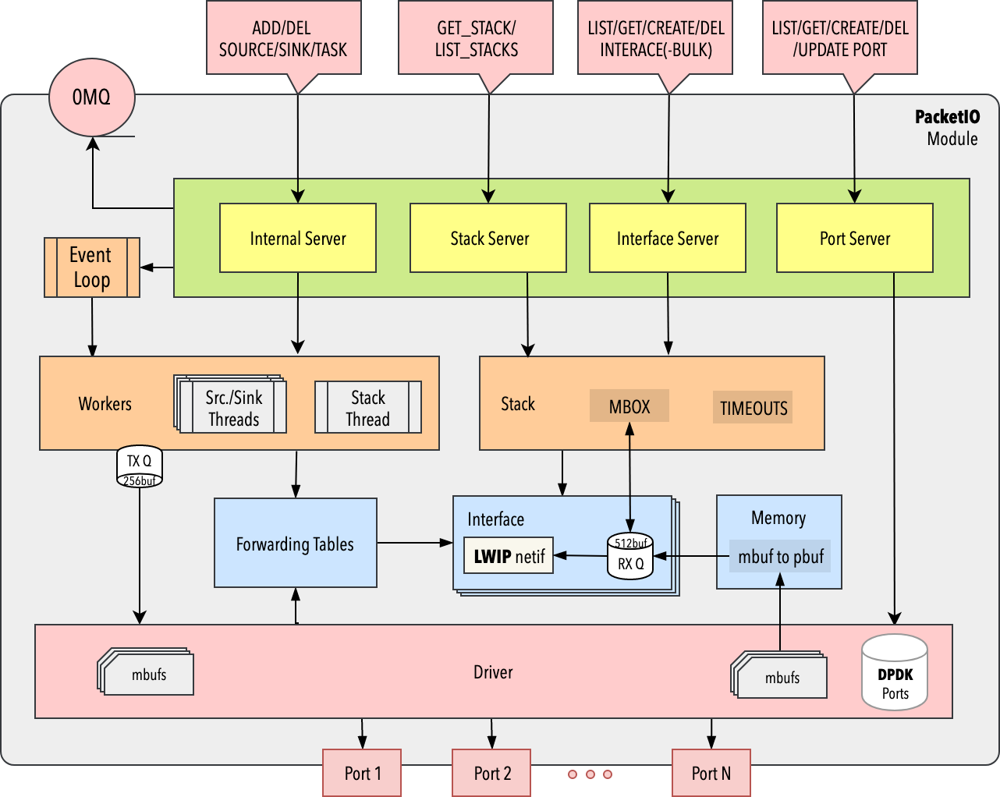

# PacketIO Module

The _packet IO_ module is the core of Inception, handling both DPDK, LWIP and the workers. It is defined as a `service` which runs multiple servers/stack and components, as shown on the diagram below:



# PacketIO Module - Interfaces

One of those servers is the `interface server` component which handles the interface related 0MQ RPC requests. 

In this section, the `BULK_CREATE_INTERFACES`  RPC request, reponsible to create a large number of interfaces in one single call, in being studied.

```C++
static void _handle_bulk_create_interface_request(generic_stack& stack, json& request, json& reply)
{
    for (auto& item : request["items"]) {
        auto interface_model = item.get<Interface>();

        // If user did not specify an id create one for them.
        if (interface_model.getId() == empty_id_string) {
            interface_model.setId(core::to_string(core::uuid::random()));
        }
        auto result = stack.create_interface(make_config_data(interface_model));
        response["items"].emplace_back(result.value());
    }
    reply["code"] = reply_code::OK;
    reply["data"] = response.dump();
    ...
}
```

The `stack` is created by the packet IO module, and is implemented as a `icp::packetio::dpdk::lwip` with driver defined as `icp::packetio::dpdk::eal::real_environment`.

> Note: the actual object is icp::packet::dpdk::eal. The real_environment is just a named constructor function. There is also a test_envionrment constructor which is used to run the AAT's and sets up virtual NICs for testing.

```C++
std::unique_ptr<generic_stack> make(driver::generic_driver& driver,
                                    workers::generic_workers& workers)
{
    return std::make_unique<generic_stack>(icp::packetio::dpdk::lwip(driver, workers));
}
```


When calling the `create_interface` on the stack, it is therefore the `lwip` stack implementation which is used

```C++
tl::expected<std::string, std::string> lwip::create_interface(const interface::config_data& config)
{
    auto port_index = m_driver.port_index(config.port_id);
    int port_idx = port_index.value();

    auto ifp = std::make_unique<net_interface>(config.id, config,
       m_workers.get_transmit_function(config.port_id), port_idx);

    m_workers.add_interface(ifp->port_id(), ifp->data());
    auto item = m_interfaces.emplace(std::make_pair(config.id, std::move(ifp)));
    return (item.first->first);

}
```

The `net_interface` is dealing the IP address allocation. The function `setup_ipv4_interface` handles _static_, _dhcp_ or _local_ IP addresses. 

```C++
net_interface::net_interface(std::string_view id, const interface::config_data& config, driver::tx_burst tx, int port_index)
    : m_id(id)
    , m_port_index(port_index)
    , m_max_gso_length(net_interface_max_gso_length(port_index))
    , m_config(config)
    , m_transmit(tx)
{
    m_netif.state = this;

    /* Setup the stack interface */
    auto protocol_config = get_protocol_config<interface::ipv4_protocol_config>(m_config)
    setup_ipv4_interface(protocol_config,  m_netif);

    /**
     * Update queuing strategy if necessary; direct is the default.
     * XXX: this decision needs to come from a constructor parameter.
     */
    if (rte_lcore_count() > 2) {
        m_receive.emplace<netif_rx_strategy::queueing>(
            std::string_view(m_netif.name, 2), 
            m_netif.num, port_index
        );
    }
    ...
}
```

The _Update queuing strategy if necessary; direct is the default._ is slightly more complex to analyse. 

The `m_receive` (of type `rx_strategy`) is used when handling RX packets, such as `(std::visit(handle_rx_visitor, m_receive))`. The `rx_strategy` can be either `direct` (no queing) or `queueing` (with a 512 element queue size). The `emplace` method is used because `m_receive` is a variant.

> Question: What is the reason for `2` in `std::string_view(m_netif.name, 2)`?

> What happens is there is only 2 or less cores? The `m_receive` would not be updated, so packets could not be received? 

>> So, this is a combination of a DPDKism and the desire to have inception work on the smallest system possible.

>> The `rte_lcore_count()` returns the total number of cores that DPDK is aware of. This includes the master core, which isn't allowed to run any data plane traffic and and worker cores which can run data plane traffic. The minimal system inception can run on is a 2 core box, where one core is the master and one core is the worker. In that case, the stack and the tx and rx worker callbacks are all run in the same thread, so it doesn't make sense to use a queue to pass the the packets around. The rx_strategy_direct structure allows the receive worker to call directly into the stack when a packet is received. Obviously, the rx_strategy_queueing just sticks the packet in a queue and (maybe) wakes up the stack. There is a similar process on the transmit side, which is why the net_interface object has driver::tx_burst, which is a transmit function, as a contstructer parameter.

>> A std::variant always contains an object. If you don't explicitly name a type, then the default constructor will instantiate the first type in the variant definition. So, when the net_interface object is created, m_receive contains a `rx_strategy_direct` object.


While the _worker_ `add_interface` copes with adding the Ethernet MAC address to the port.

```C++
void worker_controller::add_interface(std::string_view port_id, std::any interface)
{
    auto port_idx = m_driver.port_index(port_id);

    /* We really only expect one type here */
    auto ifp = std::any_cast<netif*>(interface);
    auto mac = net::mac_address(ifp->hwaddr);

    if (m_fib->find_interface(*port_idx, mac)) {
        throw std::runtime_error("Interface already exists in FIB");
    }

    auto port = model::physical_port(*port_idx, port_id);
    port.add_mac_address(mac);

    auto to_delete = m_fib->insert_interface(*port_idx, mac, ifp);
    m_recycler->writer_add_gc_callback([to_delete](){ delete to_delete; });

}
```

The `m_recycler` (of type `packetio::recycle::depot<RTE_MAX_LCORE>`) is used to safely deleting data shared with a bunch of reader threads. For instance, when the port is shutdown, it can ensure that all interfaces are cleaned-up, unless referenced by their another thread. `m_recycler` is an [RCU](https://math.mit.edu/research/highschool/primes/materials/2016/conf/10-1%20Sheth-Welling-Sheth.pdf) implementation. The worker threads will periodically update their checkpoints to let the main thread know when it is safe to run the callbacks to delete objects. 

The `port.add_mac_address` is using DPDK `rte_eth_dev_mac_addr_add` to add the MAC as a valid RX address. If this DPDK fails, the interface is turned into promiscuous mode. 

The `m_fib` (of type `packetio::forwarding_table<netif, packets::generic_sink, RTE_MAX_ETHPORTS>`) is used as the _rx distpatch table_, to know how to associate MACs to interfaces.  It is very nicely implemented as templated code. The `insert_interface` code is defined as:

```C++
interface_map* forwarding_table::insert_interface( uint16_t port_idx, const net::mac_address& mac, Interface* ifp)
{
    assert(port_idx < MaxPorts);

    auto original = m_interfaces[port_idx].load(std::memory_order_relaxed);
    auto updated = new interface_map(std::move(original->set(mac, ifp)));
    return (m_interfaces[port_idx].exchange(updated, std::memory_order_release));
}
```

The `interface_map` is defined as `immer::map<net::mac_address, Interface*>`. 
[Immer](https://sinusoid.es/immer/) is a library of persistent and immutable data structures written in C++. These enable whole new kinds of architectures for interactive and concurrent programs of striking simplicity, correctness, and performance. 

> The immer `map` provides a good trade-off between cache locality, search, update performance and structural sharing. It does so by storing the data in contiguous chunks of 2^B elements. When storing big objects, the size of these contiguous chunks can become too big, damaging performance. If this is measured to be problematic for a specific use-case, it can be solved by using a immer::box to wrap the type T.

> B default value is 5, therefore chunks can handle 32 elements. Storting 1M interfaces would require 31K chunks.