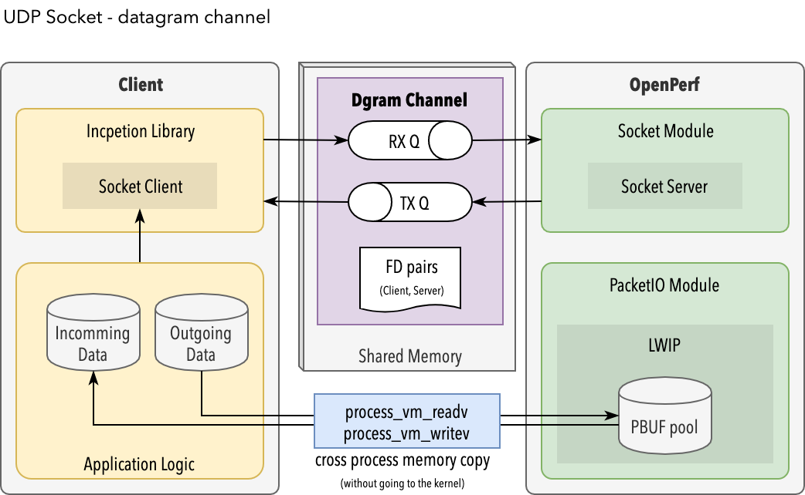
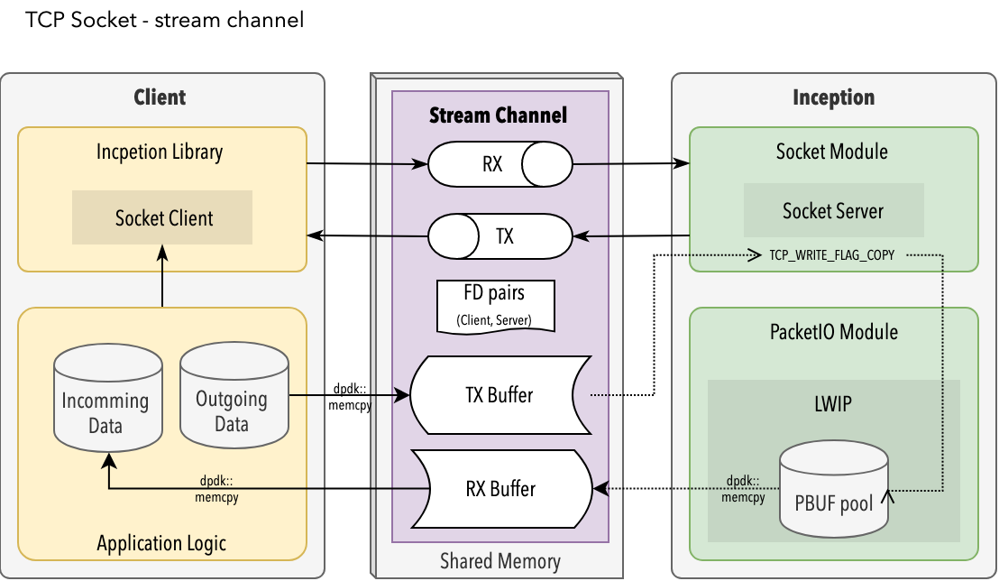

# Socket Module - UDP

There are three folders _socket_, _client_  and _server_. The _client_ is what is linked with the application, while the server resides in the OpenPerf process.

## Client Initialization

Upon startup (`openperf::socket::api::client.init()`), the client will exchange an HELLO message with the server over local unix domain socket (`unix_socket` type [`SOCK_SEQPACKET`](http://urchin.earth.li/~twic/Sequenced_Packets_Over_Ordinary_TCP.html) to `/tmp/.com.spirent.openperf/server`). The server responds with the server process ID and shared memory, as well as an optional pair of file descriptors to be used for subsequent communications.

When the client needs to create a new socket, it calls the socket equivalent wrapper [`client::socket(domain, type, protocol)`](https://github.com/SpirentOrion/inception-core/blob/master/src/modules/socket/client/api_client.cpp#L435). The server allocates a _channel_ into the shared memory, a socket FD pair, and a socket ID.

## Sending Data from the Client

Sending data over this socket (assuming UDP) will eventually call `client::sendmsg` with the destination `sockaddr` passed in the message header (`msg_name`). This method will send the data over the channel ([`channel.send`](https://github.com/SpirentOrion/inception-core/blob/master/src/modules/socket/client/api_client.cpp#L593)), which in turn, calls the _dgram channel_ implementation [`dgram_channel::send`](https://github.com/SpirentOrion/inception-core/blob/master/src/modules/socket/client/dgram_channel.cpp#L168).


```C++
ssize_t client::sendto(int s, const void *dataptr, size_t len, int flags, const struct sockaddr *to, socklen_t tolen)
{
    auto iov = iovec{
        .iov_base = const_cast<void*>(dataptr),
        .iov_len = len
    };

    auto msg = msghdr{
        .msg_name = const_cast<sockaddr*>(to),
        .msg_namelen = tolen,
        .msg_iov = &iov,
        .msg_iovlen = 1
    };

    return (sendmsg(s, &msg, flags));
}


ssize_t client::sendmsg(int s, const struct msghdr *message, int flags)
{
    auto& [id, channel] = m_channels.find(s)->second;

    channel.send(m_server_pid, message->msg_iov, message->msg_iovlen,
    	flags, reinterpret_cast<const sockaddr*>(message->msg_name));
}
```

This last method transfers the data via the [`process_vm_writev`](https://linux.die.net/man/2/process_vm_writev) system-call (the data moves directly between the address spaces of the two processes, without passing through kernel space).

```C++
dgram_channel::send(pid_t pid, iov[], iovcnt,..., sockaddr *to)
{
    auto item = sendq.unpack();
    item->address = to_addr(to);

    iovec writevec = iovec{
    	.iov_base = const_cast<void*>(item->pvec.payload()),
        .iov_len = item->pvec.len()
    };
    process_vm_writev(pid, iov, iovcnt, &writevec, 1, 0);

    item->pvec.len(result);
    sendq.repack();

    notify();
	...
}
```

The sending process does not use the shared memory. Instead, it uses the [`sendq`](https://github.com/SpirentOrion/inception-core/blob/master/src/modules/socket/bipartite_ring.h) (implemented as a bipartite ring). The item type is `dgram_channel_item`, which contains a [pbuf_vec](https://github.com/SpirentOrion/inception-core/blob/master/src/modules/socket/pbuf_vec.cpp), which carries the payload and LWIP buf pointer as well as the payload length. From the client side, the puf is anonymised.

```C++
struct dgram_channel_item {
    std::optional<dgram_channel_addr> address;
    pbuf_vec pvec;
};
```

The `notify` is implemented in the `event_queue_producer` which the `dgram_channel` inherits from. At first glance, it looks quite complex:

```C++
template <typename Derived>
int event_queue_producer<Derived>::notify()
{
    if (!count()) {
        write_idx().fetch_add(1, std::memory_order_release);
        if (auto err = eventfd_write(fd(), 1); err != 0) {
            write_idx().fetch_sub(1, std::memory_order_release);
            return (errno);
        }
    }
    return (0);
}
```

But the most imporant is the `eventfd_write(fd(), 1)` which [_just_ sends](https://stackoverflow.com/questions/18557064/where-to-find-eventfd-write-documentation) an event of value `1` to the consumer (server).

The other thing to note is that the atomic counters are used the same way as head/tail indexes of a ring buffer, but here we call them read_idx and write_idx. If read == write, then there are no outstanding notifications for the event fd. If read != write, then there are notifications. We do this to minimize our syscalls for reading/writing the fd's. So, that eventfd_write function is only called if we know for a fact that the other side is idle (and hence needs a wake up).


## Receiving Data from the Client

Receiving data (from a UDP client socket) is similar to sending data, at least in the first steps:

```C++
ssize_t client::recvfrom(int s, void *mem, size_t len, int flags,
                 struct sockaddr *from, socklen_t *fromlen)
{
    auto iov = iovec{
        .iov_base = mem,
        .iov_len = len
    };

    auto msg = msghdr{
        .msg_name = from,
        .msg_namelen = (fromlen ? *fromlen : 0),
        .msg_iov = &iov,
        .msg_iovlen = 1
    };

    auto to_return = recvmsg(s, &msg, flags);
    if (fromlen && to_return != -1) *fromlen = msg.msg_namelen;
    return (to_return);

}

ssize_t client::recvmsg(int s, struct msghdr *message, int flags)
{
    auto& [id, channel] = m_channels.find(s)->second;
    channel.recv(
    	m_server_pid, message->msg_iov, message->msg_iovlen,
    		flags, message->msg_name, &message->msg_namelen);
    ..
}
```

The actual recv implememtation also used memory copy between threads using `process_vm_readv`. The `ack_wait` is implemented in the _event queue_ and uses `eventfd_read` to wait for new events. The `ack_undo` pushes back an event on the _event queue_.

```C++
dgram_channel::recv(pid_t pid, iovec iov[], size_t iovcnt, int, ...)
{
    while (!recvq.available()) {
        if (auto error = ack_wait(); error != 0) {
            return (tl::make_unexpected(error));
        }
    }

    auto item = (flags & MSG_PEEK ? recvq.peek() : recvq.unpack());

    auto readvec = iovec {
    	.iov_base = const_cast<void*>(item->pvec.payload()),
       .iov_len = item->pvec.len()
    };
    process_vm_readv(pid, iov, iovcnt, &readvec, 1, 0);
    recvq.repack();

    notify();

    if (!recvq.available()) ack(); else ack_undo();

    ...
}
```

The line `if (!recvq.available()) ack(); else ack_undo();` is to check to see if there are any remaining data to read.  If not, it clear any pending notification.  Otherwise, it makes sure a notification remains so the client reads the rest.

But, so, where is the shared memory? To understand it, let's first dig into the server code.

## Server Initialization

When creating a socket (UDP in the following example), the server will execute `api_handler::handle_request_socket`, which will, in turn create the actual socket using [`make_socket`](https://github.com/SpirentOrion/inception-core/blob/master/src/modules/socket/server/socket_utils.cpp#L15)

	make_socket(m_allocator, request.domain, request.type, request.protocol);

When the allocator is a `openperf::memory::allocator` working with the shared memory. The make socket function will eventually call the _right_ socket implementation, in our case, the [`udp_socket`](https://github.com/SpirentOrion/inception-core/blob/master/src/modules/socket/server/udp_socket.cpp#L56)

```C++
udp_socket::udp_socket(openperf::socket::server::allocator& allocator, int flags)
{
    m_channel = new (allocator.allocate(sizeof(dgram_channel)))
    dgram_channel_deleter = &allocator
    dgram_channel = flags
    m_pcb = udp_new()

    if (!m_pcb) {
        throw std::runtime_error("Out of UDP pcb's!");
    }

    udp_recv(m_pcb.get(), &udp_receive, m_channel.get());
}
```

The `udp_new ` returns an actual LWIP pcb. The `dragm_channel` is defined as:

```C++
typedef bipartite_ring<dgram_channel_item, api::socket_queue_length> dgram_ring;

class dgram_channel : public event_queue_consumer<dgram_channel>
                    , public event_queue_producer<dgram_channel>
{
	dgram_ring sendq;  /* from client to stack */
	api::socket_fd_pair client_fds;
	std::atomic_uint64_t tx_fd_write_idx;
	std::atomic_uint64_t rx_fd_read_idx;
	dgram_ring recvq;  /* from stack to client */
	api::socket_fd_pair server_fds;
	std::atomic_uint64_t tx_fd_read_idx;
	std::atomic_uint64_t rx_fd_write_idx;
	std::atomic_int socket_flags;
```

The magic is that both send and receive queues are statically allocated as part of the `dgram_channel` -  but yet, those two queues are only holding pointers to the payload. So where is the payload actually allocated? To find the answer, let's check the receiving process.

## Receiving Data from the Server

The LWIP recv handler `udp_receive` is registered when the socket is created.

```C++
static void udp_receive(void* arg, udp_pcb* pcb, pbuf* p, const ip_addr_t* addr, in_port_t port)
{
    auto channel = reinterpret_cast<dgram_channel*>(arg);
    if (!channel->send(p, reinterpret_cast<const dgram_ip_addr*>(addr), htons(port))) {
        pbuf_free(p);
    }
}
```

Note that the `dgram_channel` referenced here is the server dgram channel. It is a seperate implementation of the client dgram channel, howerver both implementation share the same interpretation of the same underlying data. The udp receive handler then calls the chanel `send` method, which pushes a `dgram_channel_item`


```C++
bool dgram_channel::send(const pbuf *pbuf, const dgram_ip_addr* addr, in_port_t port)
{
    free_spent_pbufs(recvq);
    bool pushed = recvq.enqueue( dgram_channel_item{
    	.address = dgram_channel_addr(addr, port),
    	.pvec = pbuf_vec(const_cast<pbuf*>(p), p->payload, p->len)
    });
    if (pushed) notify();
    return (pushed);
}
```

The LWIP states that _the callback is responsible for freeing the pbuf if it's not used any more_, which is what `free_spent_pbufs` is _asynchronously_ doing.  To be considered as a `spent pbuf`, the client will first have to call `recv`.

So, in conclusion, for UDP, the shared memory is only used for the channel and queues, but not for the payload, as described on the component diagram below:



# Socket Module - TCP

As explained in the section before, the UDP socket implementation does not use the shared memory for passing the protocol buffers (pbuf's). This is however not the case for TCP, which uses shared memory for both queue and payloads.

## Sending data from the Client

The TCP client stack is implemented as the `stream_channel`. When sending data, the client will eventually run the following code:

```C++
tl::expected<size_t, int> stream_channel::send(pid_t pid, iov[], iovcount, ...) {

	auto flags = socket_flags.load(std::memory_order_relaxed);
	auto is_non_blocking = flag & EFD_NONBLOCK

	size_t buf_available = 0;
	while ((buf_available = writable()) == 0) {
	     auto error = is_non_blocking ? block() : block_wait();
         if (error!=0) return (tl::make_unexpected(error));
	}

	auto written = std::accumulate(
		iov, iov + iovcnt, 0UL, [&](size_t x, const iovec& iov) {
	      auto v = write_and_notify(iov.iov_base, iov.iov_len,
	      	[&]() { notify(); })
		  return (x + v);
	});

	if (written == buf_available && is_non_blocking && !writable()) {
	    block();   /* pre-emptive block */
	};

	notify();

	return (written);
}
```

The first part `while (writable()==0)` waits for space to be available in the ring buffer. It also handles returning EWOULDBLOCK if the socket is non-blocking and full.

The second part, `std::accumulate` over `write_and_notify`  writes the actualy data from the io vector, and, for each io chunk, notifies the server over the ring buffer.

Last, the `if (written == buf_available ...) block()` is used when the buffer is full after writing, to give a change for the client to get scheduled: If the client has just filled up the send buffer, the socket is non-blocking, and the stack hasn't read any data yet, then we mark the fd as blocked so that the client will know not to try to write any more data if they're using `poll` or `epoll` or whatever. Without that line, the fd would indicate writable status even though the socket is full, which is not the desired behavior.

An interresting scenario is to understand what happens if there is not enough space available in the buffer, when calling the `write_and_notify`? Well, just like the standard socket implmentation, `write_and_notify` will only write as many bytes as it can, and return the actual written size.

> Note: could there be a atomicity bug, because the std::accumlate does not prevents from buffer to be read while iterating the write?
>
> Answer: This buffer is a text book Single Producer, Single Consumer queue (BSD sockets aren't thread safe). The stack can only read up to the tail index in the buffer and that won't be updated until after the write completes. If the stack needs a notification, that won't happen until after the tail index is updated

The main difference with UDP is that UDP uses `sendq` (type `dgram_ring`) and  `process_vm_writev` while TCP uses `write_and_notify` only; The _simplified_ TCP socket structure is the following


```C++
class stream_channel : public circular_buffer_consumer<stream_channel>
                     , public circular_buffer_producer<stream_channel>
                     , public event_queue_consumer<stream_channel>
                     , public event_queue_producer<stream_channel>
{
	buffer tx_buffer;
	buffer rx_buffer;
	api::socket_fd_pair client_fds;
	std::atomic_int socket_error;
	std::atomic_int socket_flags;
	api::socket_fd_pair server_fds;
	void* allocator;
```


When the TCP socket is created, the server allocates the buffer from the shared memory:

```
stream_channel::stream_channel(int flags, openperf::socket::server::allocator& allocator)
    : tx_buffer(allocator.allocate(init_buffer_size), init_buffer_size)
    , rx_buffer(allocator.allocate(init_buffer_size), init_buffer_size)
    , ...
```

Where `init_buffer_size` is defined as *128 kb*. The `buffer` class is surprisingly simple, but yet very efficiently designed:

```C++
struct buffer {
    uint64_t len;
    memory::offset_ptr<uint8_t> ptr;
    buffer(uint8_t* ptr_, uint64_t len_) : ptr(ptr_) , len(len_) {}
    buffer() : ptr(memory::offset_ptr<uint8_t>::uninitialized()) {}
};
```

Note that all of the buffer data is kept in two cache aligned structs so that the read and write threads will not destructively share the data. The first struct is written to exclusively by the server thread.  The second struct is written to exclusively by the client thread.

## Receiving data from the Server

After a stream socket has accepted a new incomming connection, it receives the data via the `do_lwip_recv` method:

```C++
int tcp_socket::do_lwip_recv(pbuf *p, int err)
{
    /* Store the incoming pbuf in our buffer */
    m_recvq.push(p);

    if (p->flags & PBUF_FLAG_PUSH
        || m_recvq.length() > m_channel->send_available()) {
        do_tcp_receive_all(m_pcb.get(), *m_channel, m_recvq);
    }
}
```

The `m_recvq` is a pbuf queue. The second part `if (p->flags & PBUF_FLAG_PUSH...` initiate a copy to the client's buffer if the TCP sender sent a PUSH flag or there are more than enough data to fill the client's receive buffer.

The `do_tcp_receive_all` eventually calls the `channel.send` and then frees the pbuf (LWIP function `tcp_recved`). The channel `send` method is efficiently relying on the `circular_buffer_producer::write` method to copy the data:

```C++
size_t stream_channel::send(const iovec iov[], size_t iovcnt)
{
    auto written = write(iov, iovcnt);
    notify();
    return (written);
}
```

The `write` method makes efficient copy using the `dpdk::memcpy` helper. From the client side, when notified of available data, the client will call the `read_and_notify` which also copies the data using `dpdk::memcpy`.

## Sending data from the Server

When the client has notified of new available outgoing data (which it previously copied to the output buffer), the server needs to send this data to the LWIP stack. It does it via the `do_tcp_transmit` method (_very_ simpified in the code below):

```C++
	static size_t do_tcp_transmit(tcp_pcb* pcb, const void* ptr, size_t length, ...)
{
	size_t written = 0;
	auto to_write = std::min(length, pcb->snd_buf);

	const auto flags = TCP_WRITE_FLAG_COPY | TCP_WRITE_FLAG_MORE;

	if (tcp_write(pcb, ptr, to_write, flags) != ERR_OK) {
	    return (written);
	}

	return to_write;
}

```

The server implementation uses `TCP_WRITE_FLAG_COPY`, meaning that the client data on the TX circular buffer can be released immediately.

The following component diagram summurizes the _stream channel_ data flow.



