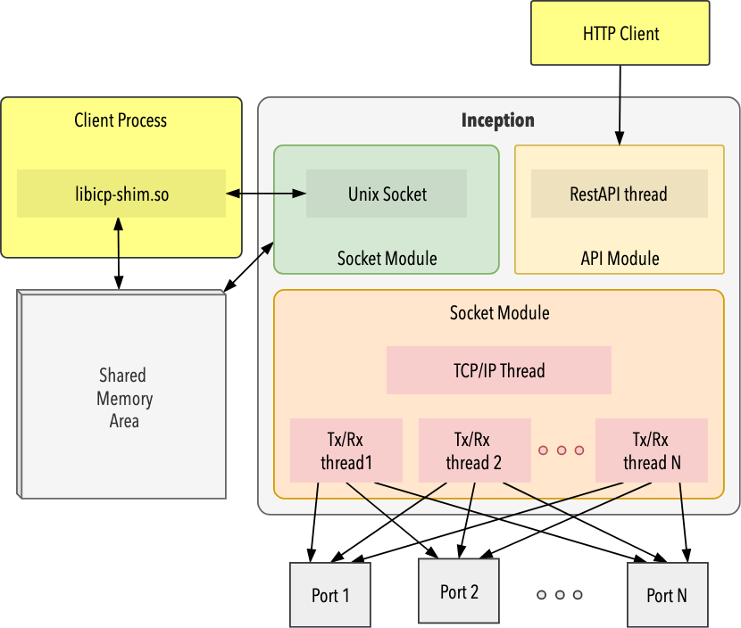

# Inception Developper Guide

*Table of contents:*

* [building](building.md)

* Internal APIs:
    - [Source and Skinks](internal-api.md)

* Modules:
    - [Socket](module-socket.md)
    - [Packet IO](module-packetio.md)
    - [Configuration](configuration.md)

---

