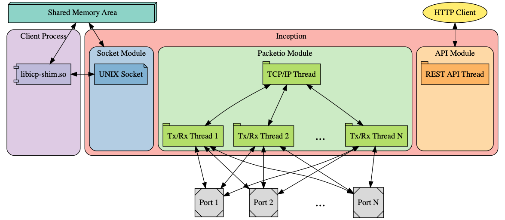

# OpenPerf Developer Guide

*Table of contents:*

* [building](building.md)

* Concepts:
    - [Let's make a module](module-creation.md)

* Internal APIs:
    - [Source and Skinks](internal-api.md)

* Modules:
    - [Socket](module-socket.md)
    - [Packet IO](module-packetio.md)
    - [Configuration](configuration.md)
    - [API](module-api.md)

* Advanced:
    - [Packet IO Workers](module-packetio-workers.md)
    - [LwIP Customization](module-packetio-lwip.md)

---

