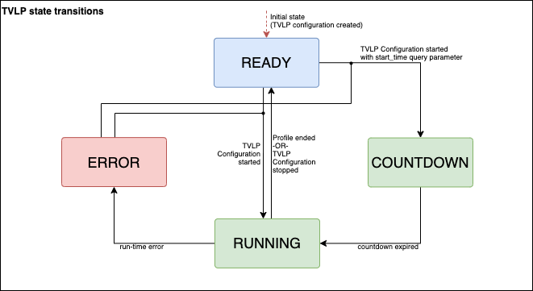
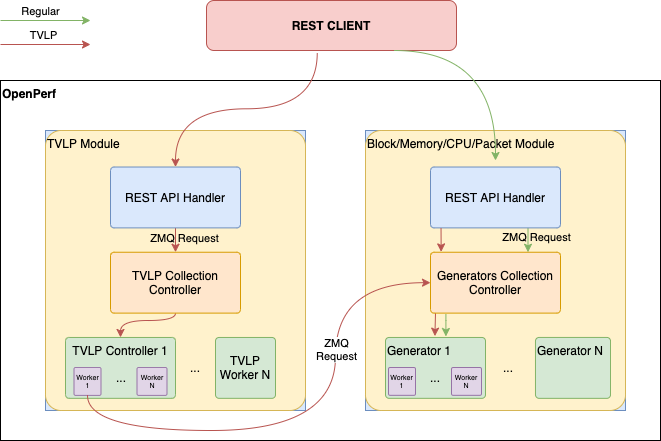

# Time Varying Load Profile

Time Varying Load Profile (TVLP) provides a mechanism to program an OpenPerf instance to perform Block, Memory, CPU and Packet modules configuration adjustments at specific times.

## Configuration

Configuration primarily consists of lists of time offsets and values for configuraton options for Block, Memory, CPU and Packet generators.

Additionally, clients may specify a specific UTC ISO8601-formatted time to start replaying the configured profile.

### States

The TVLP module contains 4 distinct states:

- READY -- TVLP contains a valid configuration and is ready to be started
- COUNTDOWN -- TVLP has been given a start time in the future and is waiting to start replaying a profile
- RUNNING -- TVLP module is replaying a profile
- ERROR -- TVLP module encountered a runtime error

#### State Diagram

State transitions behave as follows:



After a profile has completed its run, the `state` revert back to READY.

### Properties

The TVLP module responds to the following configuration properties:

* **id** - unique TVLP identifier. Leave field empty to generate value.
* **profile** - TVLP profile data
    * **block** - series set for block generator (optional)
    * **cpu** - series set for cpu generator (optional)
    * **memory** - series set for memory generator (optional)
    * **network** - series set for network generator (optional)
    * **packet** - series set for packet generator (optional)
* **state** - current TVLP profile `state`, one of: READY, COUNTDOWN, RUNNING, or ERROR (read only).
* **error** - read only string describing error condition; only when `state` == ERROR (read only).
* **time** - read-only information about execution time.
    * **start** - ISO8601-formatted TVLP profile start time. Only available when `state` = COUNTDOWN or RUNNING (read only).
    * **length** - length of current tvlp profile in ns (read only).
    * **offset** - current offset in ns. Only valid when `state` = RUNNING (read only).

#### Profile

* **series** - sequence of generator configurations
    * **config** - generator configuration
    * **length** - time of execution current configuration

#### Start parameters

* **start_time** - time of start profile in ISO8601 format.
* **memory** - start options for the _memory_ series.
* **block** - start options for the _block_ series.
* **network** - start options for the _network_ series.
* **cpu** - start options for the _cpu_ series.
* **packet** - start options for the _packet_ series.

Start options:
* **load_scale** - scale multiplier for load parameters of generators.
* **time_scale** - scale multiplier for the length of each profile entry.
* **dynamic_results** - dynamic results set for series.

### Load Scale

The load scale multiplier is a floating point value that will be applied to next load parameters of generators.

Memory Generator:
* **reads_per_sec**
* **writes_per_sec**

Block Generator:
* **reads_per_sec**
* **writes_per_sec**

CPU Generator:
* **system.utilization**
* **cores[_N_].utilization**

Network Generator:
* **reads_per_sec**
* **writes_per_sec**

Packet Generator:
* **load.burst_size**
* **load.rate.value**

## Dynamic Results

The Dynamic Results are available to use with TVLP profiles. To get more information read the dedicated documentation of a [Dynamic Results](dynamic.md). The Dynamic Results configuration can be specified for each type of generator in appropriate section at start time of a TVLP profile. Dynamic Results are available for Memory, Block, Network and CPU generators.

Example:

```json
{
    "memory": {
        "dynamic_results": {
            "thresholds": [
                {
                    "id": "",
                    "value": 1000.0,
                    "function": "dx",
                    "stat_x": "read.bytes_actual",
                    "condition": "less"
                }
            ],
            "tdigests": [
                {
                    "id": "",
                    "function": "dx",
                    "stat_x": "read.bytes_actual",
                    "compression": 10
                }
            ]
        }
    }
}
```

## TVLP Configuration Diagram

Each generator module configured by TVLP profile as follows:



## TVLP Result

TVLP creates new _Result_ with new unique ID on each Start request. While TVLP configuration is running, the result is being updated after each generation iteration. After the Profile has completed the result receives final statistics values.

## Commands flow

### Create resources for each Profile entry

### Create TVLP Configuration

[Block Generator Configuration](block.md)

[Memory Generator Configuration](memory.md)

[CPU Generator Configuration](cpu.md)

[Network Generator Configuration](network.md)

[Packet Generator Configuration](../dev-guide/module-packetio.md)

```bash
curl --location --request POST '<OPENPERF_HOST>:<OPENPERF_PORT>/tvlp' \
--header 'Content-Type: application/json' \
--data-raw ' {
        "id": "qwe2",
        "profile": {
            "block": {
                "series": [
                    {
                        "config": {$BLOCK_GENERATOR_CONFIGURATION},
                        "length": 1000000000,
                        "resource_id": "$BLOCK_RESOURCE_ID"
                    }
                ]
            },
            "memory": {
                "series": [
                    {
                        "config": {$MEMORY_GENERATOR_CONFIGURATION},
                        "length": 1000000000
                    }
                ]
            },
            "cpu": {
                "series": [
                    {
                        "config": {$CPU_GENERATOR_CONFIGURATION},
                        "length": 1000000000
                    }
                ]
            },
            "network": {
                "series": [
                    {
                        "length": 1000000000,
                        "config": {$NETWORK_GENERATOR_CONFIGURATION}
                    }
                ]
            },
            "packet": {
                "series": [
                    {
                        "config": {$PACKET_GENERATOR_CONFIGURATION},
                        "length": 100000000,
                        "target_id": "port0"
                    }
                ]
            }
        },
        "state": "ready",
        "time": {
            "length": 100000000
        }
    }'
```

### Start existing TVLP Configuration

Start immediately:
```bash
curl --location --request POST '<OPENPERF_HOST>:<OPENPERF_PORT>/tvlp/:id/start'
```

Start at specific time:
```bash
curl --location --request POST '<OPENPERF_HOST>:<OPENPERF_PORT>/tvlp/:id/start' \
--header 'Content-Type: application/json' \
--data-raw '
{
    "start_time": "2020-10-01T00:00:00.000000Z"
}'
```

### Check the created TVLP Result

```bash
curl --location --request GET '<OPENPERF_HOST>:<OPENPERF_PORT>/tvlp-results/:id'
```
