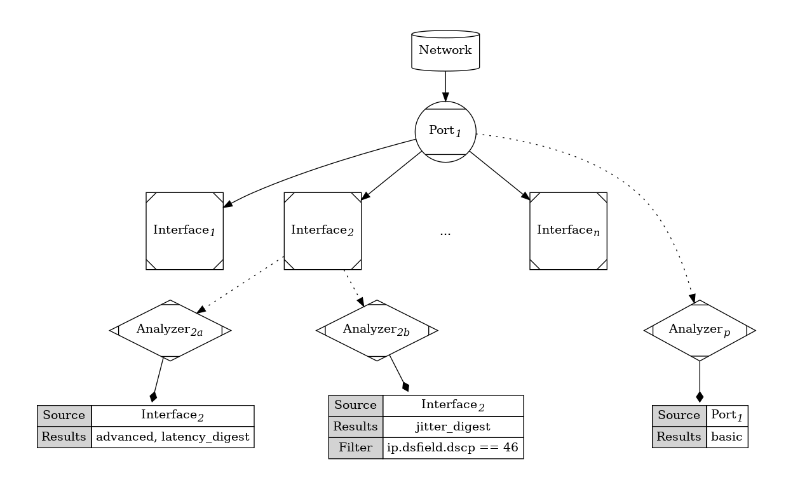
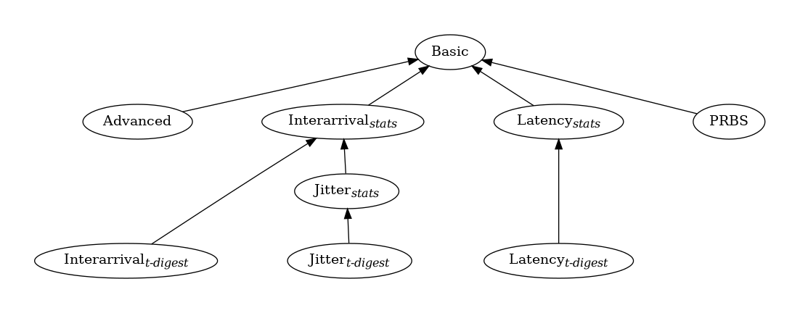
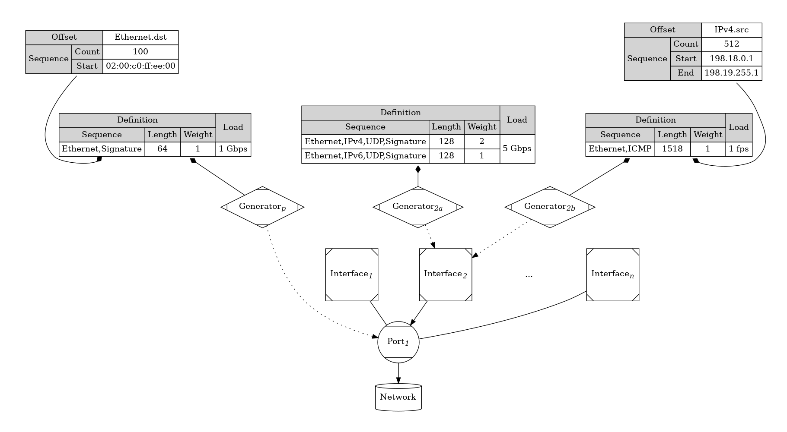

# L2-L3 Packet Generation and Analysis (PGA)

## Abstract

Unlike the traditional, hardware focused approach to stateless packet
generation and analysis, Inception treats generators and analyzers as
lightweight, immutable, and functional code blocks that can be arbitrarily
created and destroyed.  This approach allows much more flexibility that the
fixed function approach of traditional Spirent hardware.  However, this
flexibility comes at the expense of precision and repeatability.

This document describes the functional behavior of Inception stateless
Generators and Analyzers as well as their inherent limitations.

## Analyzers

At a high level, analyzers are just a means of aggregating signature
based stream statistics. Inception allows users to create an arbitrary
number of analyzers and connect them to physical or virtual ports or
interfaces.

Since analyzers are software based, the number and type of results
collected by an analyzer affects performance.  Users can limit
the performance impact of results collection via two methods:

1. Users must explicitly tell the analyzer what types of results to collect
   and generate.
2. Users can further limit frame collection by applying a packet filter rule
   using Berkeley Packet Filter (BPF) (or tcpdump) syntax.

Each analyzer provides an aggregate view of all streams matching
the collection criteria.  Individual stream results may also be queried
directly for each observed stream.

### Results

Users can select any subset of results from the set of result types.  However,
note that some result types have dependencies.  For example, one cannot
enable a latency distribution without also enabling latency results.

Any results needed to satisfy dependencies are automatically enabled.

#### Basic

Basic results represent the bare minimum set of results that can be
produced. Basic results are the default result type and are always
enabled.

* rx_frames: The number of frames received by the analyzer
* rx_octets: The number of octets received by the analyzer
* rx_errors: the number of errored frames received by the analyzer
* timestamp_first: The timestamp of the first received frame
* timestamp_last: The timestamp of the last received frame

#### Advanced

Advanced results use the sequence number in the signature field to
provide information about sequencing irregularities or duplicates.

* dropped: The number of frames expected but not received
* duplicate: The number of duplicate frames received
* late: The number of frames received outside the sequence window
* ordered: The number of frames received in sequential order
* reordered: The number of frames received in non-sequential order

#### Timing Based Stats

Interarrival time, jitter, and latency are all based around transmit
and/or receive timestamps.  Each type of result produces the same
set of results statistics.

* min: the minimum observed value
* max: the maximum observed value
* standard_deviation: the standard deviation of all observed values
* total: the sum of all observed values

##### T-Digests

In addition to the basic timing statistics above, users can also enable a result
mode that stores observed values in a t-digest. T-Digests are a specific data
structure and associated algorithms to record statistical information of streaming
data sets in both a memory and CPU efficient manner. They may be used
to generate accurate approximations of quantile, percentile, and trimmed means
from the collected data.

For example, a t-digest for latency allows clients to easily calculate any
latency percentile they would like, e.g. 50th, 95th, 99th, 99.99th, etc.

Raw t-digest data is simply a list of values and weights. The complete set of
data can be retrieved for offline analysis.

##### Legacy Histograms

In general, fixed bucket histograms have multiple problems that limit their
usefulness.

- Prior knowledge of the measured distribution is necessary to pick optimal
  bucket sizes.
- Aggregating and comparing results requires histograms to have identical
  bucket values.

For comparison, a t-digest result does not need any prior knowledge of the
measured values; it automatically handles any range.  Additionally, t-digest
results can be aggregated and compared without issue.  However, if fixed bucket
histograms are needed, they can be approximated from the t-digest data.

#### PRBS

Enabling the PRBS result causes the analyzer to check for the Pseudo-Random
Bit Sequence flag in the signature and analyze the payload if it is set.
It also adds the following result counters:

* prbs_octets: the total number of prbs data received
* prbs_errors: the total number of bit errors detected in the prbs payload

### BPF Rules

The Berkeley Packet Filter rule provides an efficient mechanism for discarding
unwanted packets.  Its presence in the analyzer configuration is to allow users
to specify test specific stream aggregations and/or to collect additional
results on specific subsets of received traffic. Users can also use the filter
rule to create their own counters.

For example, consider a test scenario where an Inception analyzer is receiving
test traffic from multiple physical network paths.  With a packet filter, a user
could create an analyzer for each physical path by adding a rule to match
specific source networks. Thus, the user could easily differentiate the
characteristics of each path.

Users can also use packet filtering to simplify Quality of Service (QoS)
testing.  Since each analyzer provides aggregate results for all matching
traffic, creating a set of analyzers to match the expected QoS levels allows
a user to analyze results at the QoS level instead of on a stream by stream
basis.

Finally, by extending the BPF rules to include Spirent signature information,
a user can easily enable statistical sampling of Spirent test traffic.  Consider
the case where someone wants to generate a latency histogram for a large volume,
e.g. multiple Gbps, of incoming test traffic.  By creating an additional
analyzer that uses a filter rule to match the signature sequence number, e.g.
"signature_seq & ffff = 0", users could analyze 1 out of every 64 thousand
frames on every received stream. The impact of generating additional results on
such a small number of frames would be minimal, but could provide valuable
information about the system under test.

## Generators

At a high level, generators are a means of generating a sequence of stateless
test traffic.  Inception allows users to create an arbitrary number of
generators and connect them to physical or virtual ports or interfaces.

Users must provide a list of traffic definitions that specify the frames to
send and the rate and duration to send them.

Each generator produces an aggregate set of results for all generated streams.
Individual stream results for each transmitted stream may also be queried
directly.

Note: interfaces are the only mechanism Inception has for address resolution
and neighbor discovery, so automatic destination address learning is only done
when generators are bound to interfaces.  Port bound generators are expected
to be useful for L2 testing.

### Traffic Duration

Traffic duration may be specified as either a number of seconds or as a number
of packets.

### Traffic Definitions

Each generator requires a list of traffic definitions. Each traffic definition
contains a list of frame descriptors that describe the generated traffic frames
and the rate to send them.

If multiple traffic definitions are present, the user should specify the number of
times the generator should transmit the full sequence of frames in each descriptor
before continuing to the next descriptor. This allows chaining streams together.

Each frame descriptor consists of a 3-tuple containing:

* frame sequence: the set of headers and modifiers for the transmitted frames
* frame length: the lengths of the generated frames on the wire (includes CRC)
* scalar weight: the number of times this frame sequence is repeated in the
                 traffic definition

If multiple frame descriptors are present, users must specify how the
generator should order the frame sequences for transmission.

* sequential: Transmit all the frames from frame descriptor 1, then all the
              frames from frame descriptor 2, ...
* round-robin: Alternate between all frame descriptors in an iterative manner
               while respecting weights.

The generator repeats the frame sequences specified in the traffic definition
until the user specified generator duration or sequence count, if specified,
is reached.

#### Frame Lengths

Frame lengths may be fixed or variable.  Variable frame lengths are applied
identically to all generated stream IDs.

#### Traffic Loads

Users specify traffic loads via two parameters: an aggregate rate and a burst
size.

##### Rates

Rates are specified in either frames or octets per second.

##### Burst Size

The burst size tells the generator how many frames to send as part of an atomic
transmit operation.  Larger burst sizes are more efficient and allow higher
traffic rates. Lower burst sizes provide more even spacing between frames. The
most even packet pacing is achieved with a burst size of 1.

#### Load Control

Since a software based packet generator is subject to the vagaries of software
scheduling, each generator uses a feedback loop to adjust the actual transmit
rate to match the user's intended rate.  While this _might_ produce burstier
test traffic than the user intended, this outcome is more desirable than
generating erroneous traffic loads.  Additionally, this allows us to minimize
the difference between the intended and actual transmit rate over time.

### Results

Generators produce only one set of results.  These results are provided for
each stream.  Aggregated results are provided for each generator.

* errors: The number of frames that could not be transmitted due to an error
* frames_actual: The number of frames transmitted by the generator
* frames_intended: The number of frames that *should* have been transmitted by
                   the generator
* octets_actual: The number of octets transmitted by the generator
* octets_intended: The number of octets that *should* have been transmitted by
                   the generator
* timestamp_first: The timestamp of the first transmitted frame
* timestamp_last: The timestamp of the most recently transmitted frame

### Frame Sequence

A frame sequence consists of a list of protocol headers, a list of modifiers,
and a method for combining the modifiers to generate a sequence of frames.
This sequence is used to program generators to transmit stateless test traffic.

#### Headers

All headers contain default values for every field so that no header properties
are explicitly required.  Additionally, higher layer headers automatically
update lower layer ones, thus adding a UDP header to an IPv4 header
automatically sets the IP protocol to the correct value for the UDP payload.

User specified values will never be modified.

#### Modifiers

Modifiers specify a sequence of values to insert into a header when transmitted
by a generator and come in two distinct types: a mathematical sequence or an
arbitrary list.

Multiple modifiers may be present in a frame sequence.  In that case, the user
must specify how the modifiers are combined to generate modifier tuples for
the sequence.

* zip: Generate modifier tuples by combining values by index, thus
  frame 1 would contain modifier 1:value 1, modifier 2: value 1,
  modifier n: value 1.  Shorter modifier lists are treated as a ring to
  accommodate longer modifier lists.
* product: Use the Cartesian product of all modifier tuples to generate
  the frame sequence.

Each modifier tuple corresponds to a signature stream id.

##### Sequence Modifiers

Users must set the following values for sequence based modifiers:

* offset: Specifies where in the frame/header the modifier values should be
          placed.
* sequence: Specifies the set of values to insert into the frame header. The
            step value is inferred from the three parameters below:
  - count: The total number of modifier values
  - start: The first value of the sequence
  - end: The last value in the sequence; defaults to start + (count - 1), hence
         the default step is 1.
* width: Specifies how many octets in the header the value occupies. Obviously,
         this should be large enough to accommodate all values in the sequence.
* permute: Indicates whether the values should be generated in order or not.
           The permuted order is pseudo-random and repeatable.
* skip: A list of values that are part of the sequence but should not actually
        be generated.

##### List Modifiers

Users must set the following values for list based modifiers:

* offset: Specifies where in the frame/header the modifier values should be
          placed.
* list: Specifies the list of values to insert into the frame header.
* width: Specifies how many octets in the header the value occupies. Obviously,
         this should be large enough to accommodate all values in the list.
* permute: Indicates whether the values should be generated in order or not.
           The permuted order is pseudo-random and repeatable.

#### Interface "Binding"

When test traffic uses an interface as its "source", unmodified header source
fields are populated with interface address values.  If a user adds their
own source IP address values or modifiers, then the resultant traffic will
appear to be generated by network endpoints "behind" the bound interface.

### Capturing

Inception provides a capture mechanism that follows the same design outline
as the generator and analyzer.  Users can create an arbitrary number of
capture instances and attach them to physical or virtual ports or interfaces.

Users must tell the capture instance which direction to capture: transmit,
receive, or both.  They must also specify a duration in either seconds
or frames.

Users may optionally tell the capture instance the following:

* signatures: include signature frames in capture or not
* length: truncate captured frames beyond this value
* filter: an optional BPF filter to limit what is captured

## Addendum

### Definitions

* BPF: Berkeley Packet Filter. A mechanism and syntax for efficiently filtering
       packets.
* Interface: An interface refers to a layer 3 network endpoint. Interfaces may
             have IPv4 addresses, IPv6 addresses, or both.
* Port: A port refers to an exchange point between Inception and a network.
        For Inception, it may be either a physical or virtual NIC or a set of
        bonded NICs.
* T-Digest: A data structure and associated algorithms to efficiently generate quantile
            approximations of streaming data with fixed memory and error bounds.

### NIC/FPGA Integration

Generating and analyzing the Spirent test signature is computationally
expensive.  Additionally, generating test frames in software has obvious
limitations with regard to controlling the actual rate of frame generation.
The items below would be very beneficial in providing a software platform with
capabilities consummate with traditional Spirent hardware.

* Signature Offloads
  - TX Offloads
    - Scramble the signature
    - Fill in signature CRC field
    - Fill in signature checksum cheater field
    - Fill in optional PRBS payload
    - Gather (transmit a frame from multiple buffers)
  - RX Offloads
    - Signature detection
    - De-scramble the signature
    - Check signature CRC field
    - Check optional PRBS payload
    - Scatter (write received frames into multiple buffers)

* Time-stamping
  - Insert transmit timestamp into signature
  - Generate timestamp for each received packet
  - Provide a way to read the timestamp counter
  - Provide a way to sync the timestamp counter to an external time source by
    writing both an offset and a ppm adjustment

* Transmit Scheduling
  - Use a software provided timestamp as a scheduling hint for when to
    transmit a frame. Specifically, the FPGA should delay transmitting the
    frame until the time in the timestamp.

* Multiple hardware queues: multiple transmit and receive queues are necessary
  to distribute packet processing work to multiple CPU cores.  On the receive
  side, the NIC should be able to assign incoming signature traffic to a
  receive queue by hashing the signature's stream id.
